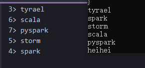

# DataStream API编程

## DataStream API开发概述

DataStream programs in Flink are regular programs that implement transformations on **data streams** (e.g., **filtering, updating state, defining windows, aggregating**). The data streams are initially created from **various sources** (e.g., **message queues**, **socket streams**, **files**). Results are returned via **sinks**, which may for example write the data to files, or to standard output (for example the command line terminal). Flink programs run in a variety of contexts, standalone, or embedded in other programs. The execution can happen in a local JVM, or on clusters of many machines.

In order to create your own Flink DataStream program, we encourage you to start with [anatomy of a Flink Program](https://ci.apache.org/projects/flink/flink-docs-release-1.11/zh/dev/datastream_api.html#anatomy-of-a-flink-program) and gradually add your own [stream transformations](https://ci.apache.org/projects/flink/flink-docs-release-1.11/dev/stream/operators/index.html). The remaining sections act as references for additional operations and advanced features.

## Data Sources

- [**Java**](https://ci.apache.org/projects/flink/flink-docs-release-1.11/zh/dev/datastream_api.html#tab_java_2)

Sources are where your program reads its input from. You can attach a source to your program by using `StreamExecutionEnvironment.addSource(sourceFunction)`. Flink comes with a number of pre-implemented source functions, but you can always write your own custom sources by implementing the `SourceFunction` **for non-parallel sources**, or by implementing the `ParallelSourceFunction` interface or extending the `RichParallelSourceFunction` for parallel sources.

There are several predefined stream sources accessible from the `StreamExecutionEnvironment`:

File-based:

- `readTextFile(path)` - Reads text files, i.e. files that respect the `TextInputFormat` specification, line-by-line and returns them as Strings.

- `readFile(fileInputFormat, path)` - Reads (once) files as dictated by the specified file input format.

- `readFile(fileInputFormat, path, watchType, interval, pathFilter, typeInfo)` - This is the method called internally by the two previous ones. It reads files in the `path` based on the given `fileInputFormat`. Depending on the provided `watchType`, this source may periodically monitor (every `interval` ms) the path for new data (`FileProcessingMode.PROCESS_CONTINUOUSLY`), or process once the data currently in the path and exit (`FileProcessingMode.PROCESS_ONCE`). Using the `pathFilter`, the user can further exclude files from being processed.

  *IMPLEMENTATION:*

  Under the hood, Flink splits the file reading process into two sub-tasks, namely *directory monitoring* and *data reading*. Each of these sub-tasks is implemented by a separate entity. Monitoring is implemented by a single, **non-parallel** (parallelism = 1) task, while reading is performed by multiple tasks running in parallel. The parallelism of the latter is equal to the job parallelism. The role of the single monitoring task is to scan the directory (periodically or only once depending on the `watchType`), find the files to be processed, divide them in *splits*, and assign these splits to the downstream readers. The readers are the ones who will read the actual data. Each split is read by only one reader, while a reader can read multiple splits, one-by-one.

  *IMPORTANT NOTES:*

  1. If the `watchType` is set to `FileProcessingMode.PROCESS_CONTINUOUSLY`, when a file is modified, its contents are re-processed entirely. This can break the “exactly-once” semantics, as appending data at the end of a file will lead to **all** its contents being re-processed.
  2. If the `watchType` is set to `FileProcessingMode.PROCESS_ONCE`, the source scans the path **once** and exits, without waiting for the readers to finish reading the file contents. Of course the readers will continue reading until all file contents are read. Closing the source leads to no more checkpoints after that point. This may lead to slower recovery after a node failure, as the job will resume reading from the last checkpoint.

Socket-based:

- `socketTextStream` - Reads from a socket. Elements can be separated by a delimiter分隔符.

Collection-based:

- `fromCollection(Collection)` - Creates a data stream from the Java Java.util.Collection. All elements in the collection must be of the same type.
- `fromCollection(Iterator, Class)` - Creates a data stream from an iterator. The class specifies the data type of the elements returned by the iterator.
- `fromElements(T ...)` - Creates a data stream from the given sequence of objects. All objects must be of the same type.
- `fromParallelCollection(SplittableIterator, Class)` - Creates a data stream from an iterator, in parallel. The class specifies the data type of the elements returned by the iterator.
- `generateSequence(from, to)` - Generates the sequence of numbers in the given interval, in parallel.

Custom:

- `addSource` - Attach a new source function. For example, to read from Apache Kafka you can use `addSource(new FlinkKafkaConsumer010<>(...))`. See [connectors](https://ci.apache.org/projects/flink/flink-docs-release-1.11/dev/connectors/index.html) for more details.

- [**Scala**](https://ci.apache.org/projects/flink/flink-docs-release-1.11/zh/dev/datastream_api.html#tab_scala_2)

Sources are where your program reads its input from. You can attach a source to your program by using `StreamExecutionEnvironment.addSource(sourceFunction)`. Flink comes with a number of pre-implemented source functions, but you can always write your own custom sources by implementing the `SourceFunction` for non-parallel sources, or by implementing the `ParallelSourceFunction` interface or extending the `RichParallelSourceFunction` for parallel sources.

There are several predefined stream sources accessible from the `StreamExecutionEnvironment`:

File-based:

- `readTextFile(path)` - Reads text files, i.e. files that respect the `TextInputFormat` specification, line-by-line and returns them as Strings.

- `readFile(fileInputFormat, path)` - Reads (once) files as dictated by the specified file input format.

- `readFile(fileInputFormat, path, watchType, interval, pathFilter)` - This is the method called internally by the two previous ones. It reads files in the `path` based on the given `fileInputFormat`. Depending on the provided `watchType`, this source may periodically monitor (every `interval` ms) the path for new data (`FileProcessingMode.PROCESS_CONTINUOUSLY`), or process once the data currently in the path and exit (`FileProcessingMode.PROCESS_ONCE`). Using the `pathFilter`, the user can further exclude files from being processed.

  *IMPLEMENTATION:*

  Under the hood, Flink splits the file reading process into two sub-tasks, namely *directory monitoring* and *data reading*. Each of these sub-tasks is implemented by a separate entity. Monitoring is implemented by a single, **non-parallel** (parallelism = 1) task, while reading is performed by multiple tasks running in parallel. The parallelism of the latter is equal to the job parallelism. The role of the single monitoring task is to scan the directory (periodically or only once depending on the `watchType`), find the files to be processed, divide them in *splits*, and assign these splits to the downstream readers. The readers are the ones who will read the actual data. Each split is read by only one reader, while a reader can read multiple splits, one-by-one.

  *IMPORTANT NOTES:*

  1. If the `watchType` is set to `FileProcessingMode.PROCESS_CONTINUOUSLY`, when a file is modified, its contents are re-processed entirely. This can break the “exactly-once” semantics, as appending data at the end of a file will lead to **all** its contents being re-processed.
  2. If the `watchType` is set to `FileProcessingMode.PROCESS_ONCE`, the source scans the path **once** and exits, without waiting for the readers to finish reading the file contents. Of course the readers will continue reading until all file contents are read. Closing the source leads to no more checkpoints after that point. This may lead to slower recovery after a node failure, as the job will resume reading from the last checkpoint.

Socket-based:

- `socketTextStream` - Reads from a socket. Elements can be separated by a delimiter.

```scala
object DataStreamSourceApp {

  def main(args: Array[String]): Unit = {
    val env = StreamExecutionEnvironment.getExecutionEnvironment

    socketFunction(env)

    env.execute("DataStreamSourceApp")
  }

  def socketFunction(env: StreamExecutionEnvironment): Unit = {
    val data = env.socketTextStream("localhost",9999)

    data.print()
  }
}
```

出来的数据如图所示，前面的序号为并行度，如果想不显示需要使用`data.print().setParallelism(1)`将并行度设置为1



Collection-based:

- `fromCollection(Seq)` - Creates a data stream from the Java Java.util.Collection. All elements in the collection must be of the same type.
- `fromCollection(Iterator)` - Creates a data stream from an iterator. The class specifies the data type of the elements returned by the iterator.
- `fromElements(elements: _*)` - Creates a data stream from the given sequence of objects. All objects must be of the same type.
- `fromParallelCollection(SplittableIterator)` - Creates a data stream from an iterator, in parallel. The class specifies the data type of the elements returned by the iterator.
- `generateSequence(from, to)` - Generates the sequence of numbers in the given interval, in parallel.

Custom:

- `addSource` - Attach a new source function. For example, to read from Apache Kafka you can use `addSource(new FlinkKafkaConsumer010<>(...))`. See [connectors](https://ci.apache.org/projects/flink/flink-docs-release-1.11/dev/connectors/) for more details.