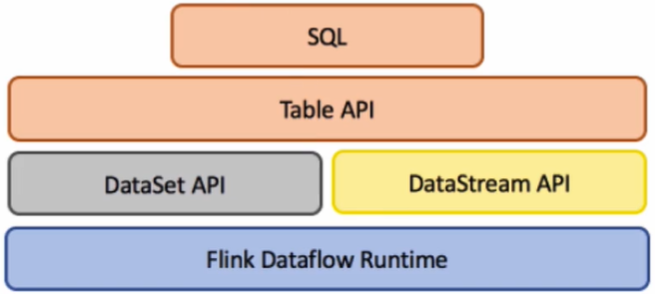

# Table API&SQL编程

## 什么是Flink关系型API



DataSet&DataStream API
	1) 熟悉两套API：DataSet/DataStream   Java/Scala
		MapReduce ==> Hive SQL
		Spark ==> Spark SQL
		Flink ==> SQL
	2) Flink是支持批处理/流处理，如何做到API层面的统一	

==> Table & SQL API  关系型API

## Table API&SQL开发概述

Apache Flink 有两种关系型 API 来做流批统一处理：Table API 和 SQL。Table API 是用于 Scala 和 Java 语言的查询API，它可以用一种非常直观的方式来组合使用选取、过滤、join 等关系型算子。Flink SQL 是基于 [Apache Calcite](https://calcite.apache.org/) 来实现的标准 SQL。这两种 API 中的查询对于批（DataSet）和流（DataStream）的输入有相同的语义，也会产生同样的计算结果。

Table API 和 SQL 两种 API 是紧密集成的，以及 DataStream 和 DataSet API。你可以在这些 API 之间，以及一些基于这些 API 的库之间轻松的切换。比如，你可以先用 [CEP](https://ci.apache.org/projects/flink/flink-docs-release-1.11/zh/dev/libs/cep.html) 从 DataStream 中做模式匹配，然后用 Table API 来分析匹配的结果；或者你可以用 SQL 来扫描、过滤、聚合一个批式的表，然后再跑一个 [Gelly 图算法](https://ci.apache.org/projects/flink/flink-docs-release-1.11/zh/dev/libs/gelly/index.html) 来处理已经预处理好的数据。

**注意：Table API 和 SQL 现在还处于活跃开发阶段，还没有完全实现所有的特性。不是所有的 [Table API，SQL] 和 [流，批] 的组合都是支持的。**

## Table API&SQL编程

### 依赖图

从1.9开始，Flink 提供了两个 Table Planner 实现来执行 Table API 和 SQL 程序：Blink Planner 和 Old Planner，Old Planner 在1.9之前就已经存在了。 Planner 的作用主要是把关系型的操作翻译成可执行的、经过优化的 Flink 任务。两种 Planner 所使用的优化规则以及运行时类都不一样。 它们在支持的功能上也有些差异。

**注意** 对于生产环境，我们建议使用在1.11版本之后已经变成默认的Blink Planner。

所有的 Table API 和 SQL 的代码都在 `flink-table` 或者 `flink-table-blink` Maven artifacts 下。

下面是各个依赖：

- `flink-table-common`: 公共模块，比如自定义函数、格式等需要依赖的。
- `flink-table-api-java`: Table 和 SQL API，使用 Java 语言编写的，给纯 table 程序使用（还在早期开发阶段，不建议使用）
- `flink-table-api-scala`: Table 和 SQL API，使用 Scala 语言编写的，给纯 table 程序使用（还在早期开发阶段，不建议使用）
- `flink-table-api-java-bridge`: Table 和 SQL API 结合 DataStream/DataSet API 一起使用，给 Java 语言使用。
- `flink-table-api-scala-bridge`: Table 和 SQL API 结合 DataStream/DataSet API 一起使用，给 Scala 语言使用。
- `flink-table-planner`: table Planner 和运行时。这是在1.9之前 Flink 的唯一的 Planner，但是从1.11版本开始我们不推荐继续使用。
- `flink-table-planner-blink`: 新的 Blink Planner，从1.11版本开始成为默认的 Planner。
- `flink-table-runtime-blink`: 新的 Blink 运行时。
- `flink-table-uber`: 把上述模块以及 Old Planner 打包到一起，可以在大部分 Table & SQL API 场景下使用。打包到一起的 jar 文件 `flink-table-*.jar` 默认会直接放到 Flink 发行版的 `/lib` 目录下。
- `flink-table-uber-blink`: 把上述模块以及 Blink Planner 打包到一起，可以在大部分 Table & SQL API 场景下使用。打包到一起的 jar 文件 `flink-table-blink-*.jar` 默认会放到 Flink 发行版的 `/lib` 目录下。

关于如何使用 Old Planner 以及 Blink Planner，可以参考[公共 API](https://ci.apache.org/projects/flink/flink-docs-release-1.11/zh/dev/table/common.html)。

### Table 程序依赖

取决于你使用的编程语言，选择 Java 或者 Scala API 来构建你的 Table API 和 SQL 程序：

```xml
<!-- Either... -->
<dependency>
  <groupId>org.apache.flink</groupId>
  <artifactId>flink-table-api-java-bridge_2.11</artifactId>
  <version>1.11.0</version>
  <scope>provided</scope>
</dependency>
<!-- or... -->
<dependency>
  <groupId>org.apache.flink</groupId>
  <artifactId>flink-table-api-scala-bridge_2.11</artifactId>
  <version>1.11.0</version>
  <scope>provided</scope>
</dependency>
```

除此之外，如果你想在 IDE 本地运行你的程序，你需要添加下面的模块，具体用哪个取决于你使用哪个 Planner：

```xml
<!-- Either... (for the old planner that was available before Flink 1.9) -->
<dependency>
  <groupId>org.apache.flink</groupId>
  <artifactId>flink-table-planner_2.11</artifactId>
  <version>1.11.0</version>
  <scope>provided</scope>
</dependency>
<!-- or.. (for the new Blink planner) -->
<dependency>
  <groupId>org.apache.flink</groupId>
  <artifactId>flink-table-planner-blink_2.11</artifactId>
  <version>1.11.0</version>
  <scope>provided</scope>
</dependency>
```

内部实现上，部分 table 相关的代码是用 Scala 实现的。所以，下面的依赖也需要添加到你的程序里，不管是批式还是流式的程序：

```xml
<dependency>
  <groupId>org.apache.flink</groupId>
  <artifactId>flink-streaming-scala_2.11</artifactId>
  <version>1.11.0</version>
  <scope>provided</scope>
</dependency>
```

### 扩展依赖

如果你想实现[自定义格式](https://ci.apache.org/projects/flink/flink-docs-release-1.11/zh/dev/table/sourceSinks.html#define-a-tablefactory)来解析 Kafka 数据，或者[自定义函数](https://ci.apache.org/projects/flink/flink-docs-release-1.11/zh/dev/table/functions/systemFunctions.html)，下面的依赖就足够了，编译出来的 jar 文件可以直接给 SQL Client 使用：

```xml
<dependency>
  <groupId>org.apache.flink</groupId>
  <artifactId>flink-table-common</artifactId>
  <version>1.11.0</version>
  <scope>provided</scope>
</dependency>
```

当前，本模块包含以下可以扩展的接口：

- `SerializationSchemaFactory`
- `DeserializationSchemaFactory`
- `ScalarFunction`
- `TableFunction`
- `AggregateFunction`

