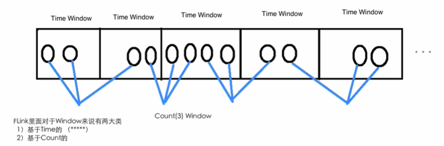

# Flink中的Time及Windows的使用

## Flink中的Time类型

### Event Time / Processing Time / Ingestion Time

Flink supports different notions of *time* in streaming programs.


对于Flink里面的三种时间：

- **事件时间**

  **Event time:** Event time is the time that each individual event occurred on its producing device. This time is typically embedded within the records before they enter Flink, and that *event timestamp* can be extracted from each record. In event time, the progress of time depends on the data, not on any wall clocks. Event time programs must specify how to generate *Event Time Watermarks*, which is the mechanism that signals progress in event time. This watermarking mechanism is described in a later section, [below](https://ci.apache.org/projects/flink/flink-docs-release-1.7/dev/event_time.html#event-time-and-watermarks).

  **事件时间：**事件时间是指每个事件在其生产设备上发生的时间。 通常在记录进入Flink之前将其嵌入到记录中，并且可以从每个记录中提取事件时间戳。 在事件时间中，时间的进度取决于数据，而不取决于任何挂钟。 事件时间程序必须指定如何生成*事件时间水印”*，这是信号事件时间进展的机制。 此水印机制将在后面的部分[以下](https://ci.apache.org/projects/flink/flink-docs-release-1.7/dev/event_time.html#event-time-and-watermarks)中进行描述。 

  In a perfect world, event time processing would yield completely consistent and deterministic results, regardless of when events arrive, or their ordering. However, unless the events are known to arrive in-order (by timestamp), event time processing incurs some latency while waiting for out-of-order events. As it is only possible to wait for a finite period of time, this places a limit on how deterministic event time applications can be.

  在理想情况下，事件时间处理将产生**完全一致且确定**的结果，而不管事件何时到达或它们的顺序如何。 但是，除非已知事件是按时间戳（按时间戳）到达的，否则事件时间处理会在等待无序事件时产生一些延迟。 由于只能等待有限的时间，因此这**限制了**确定性事件时间应用程序的**可用性**。

  Assuming all of the data has arrived, event time operations will behave as expected, and produce correct and consistent results even when working with out-of-order or late events, or when reprocessing historic data. For example, an hourly event time window will contain all records that carry an event timestamp that falls into that hour, regardless of the order in which they arrive, or when they are processed. (See the section on [late events](https://ci.apache.org/projects/flink/flink-docs-release-1.7/dev/event_time.html#late-elements) for more information.)

  假设所有数据都已到达，事件时间操作将按预期方式运行，即使在处理无序或迟到事件或重新处理历史数据时，也会产生正确且一致的结果。 例如，每小时事件时间窗口将包含所有带有落入该小时事件时间戳的记录，无论它们到达的顺序或处理的时间。 （有关更多信息，请参见[晚期事件](https://ci.apache.org/projects/flink/flink-docs-release-1.7/dev/event_time.html#late-elements)部分。）

  Note that sometimes when event time programs are processing live data in real-time, they will use some *processing time* operations in order to guarantee that they are progressing in a timely fashion.

  请注意，有时当事件时间程序实时处理实时数据时，它们将使用一些“处理时间”操作，以确保它们及时进行。

- **摄取时间**

  **Ingestion time:** Ingestion time is the time that events enter Flink. At the source operator each record gets the source’s current time as a timestamp, and time-based operations (like time windows) refer to that timestamp.

  **摄取时间：**摄取时间是事件进入Flink的时间。 在源操作员处，每条记录都将源的当前时间作为时间戳记，并且基于时间的操作（例如时间窗口）引用该时间戳记。

  *Ingestion time* sits conceptually in between *event time* and *processing time*. Compared to *processing time*, it is slightly more expensive, but gives more predictable results. Because *ingestion time* uses stable timestamps (assigned once at the source), different window operations over the records will refer to the same timestamp, whereas in *processing time* each window operator may assign the record to a different window (based on the local system clock and any transport delay).

  *摄取时间*在概念上位于*事件时间*和*处理时间*之间。 与*处理时间*相比，它稍微贵一点，但结果却更可预测。 由于*摄取时间*使用稳定的时间戳（在源处分配了一次），因此对记录的不同窗口操作将引用相同的时间戳，而在*处理时间*中，每个窗口操作员都可以将记录分配给不同的窗口（基于 本地系统时钟和任何传输延迟）。

  Compared to *event time*, *ingestion time* programs cannot handle any out-of-order events or late data, but the programs don’t have to specify how to generate *watermarks*.

  与“事件时间”相比，“摄入时间”程序不能处理任何乱序事件或迟到的数据，但是程序不必指定如何生成“水印”。

  Internally, *ingestion time* is treated much like *event time*, but with automatic timestamp assignment and automatic watermark generation.

  在内部，“摄取时间”与“事件时间”非常相似，但是具有自动时间戳分配和自动水印生成功能。

- **处理时间**

  **Processing time:** Processing time refers to the system time of the machine that is executing the respective operation.

  **处理时间：**处理时间是指执行相应操作的机器的系统时间。

  When a streaming program runs on processing time, all time-based operations (like time windows) will use the system clock of the machines that run the respective operator. An hourly processing time window will include all records that arrived at a specific operator between the times when the system clock indicated the full hour. For example, if an application begins running at 9:15am, the first hourly processing time window will include events processed between 9:15am and 10:00am, the next window will include events processed between 10:00am and 11:00am, and so on.

  当流式程序按处理时间运行时，所有基于时间的操作（如时间窗口）都将使用运行该操作的计算机系统时钟。 每小时处理时间窗口将包括系统时钟指示整小时的时间之间到达特定操作的所有记录。 例如，如果应用程序在9:15 am开始运行，则第一个每小时处理时间窗口将包括在9:15 am和10:00 am之间处理的事件，下一个窗口将包括在10:00 am和11:00 am之间处理的事件，依此类推。

  Processing time is the simplest notion of time and requires no coordination between streams and machines. It provides the best performance and the lowest latency. However, in distributed and asynchronous environments processing time does not provide determinism, because it is susceptible to the speed at which records arrive in the system (for example from the message queue), to the speed at which the records flow between operators inside the system, and to outages (scheduled, or otherwise).

  处理时间是最简单的时间概念，不需要流和机器之间的协调。 它提供了最佳的性能和最低的延迟。 但是，在分布式和异步环境中，处理时间不能提供确定性，因为它容易受到记录到达系统的速度（例如，从消息队列中来），记录在系统内部的操作员之间流动的速度以及中断（计划的或其他方式）的影响。

### Setting a Time Characteristic

The first part of a Flink DataStream program usually sets the base *time characteristic*. That setting defines how data stream sources behave (for example, whether they will assign timestamps), and what notion of time should be used by window operations like `KeyedStream.timeWindow(Time.seconds(30))`.

The following example shows a Flink program that aggregates events in hourly time windows. The behavior of the windows adapts with the time characteristic.

```java
final StreamExecutionEnvironment env = StreamExecutionEnvironment.getExecutionEnvironment();

env.setStreamTimeCharacteristic(TimeCharacteristic.ProcessingTime);

// alternatively:
// env.setStreamTimeCharacteristic(TimeCharacteristic.IngestionTime);
// env.setStreamTimeCharacteristic(TimeCharacteristic.EventTime);

DataStream<MyEvent> stream = env.addSource(new FlinkKafkaConsumer09<MyEvent>(topic, schema, props));

stream
    .keyBy( (event) -> event.getUser() )
    .timeWindow(Time.hours(1))
    .reduce( (a, b) -> a.add(b) )
    .addSink(...);
```

## Flink中的Windows编程

Windows are at the heart of processing infinite streams. Windows split the stream into “buckets” of finite size, over which we can apply computations. This document focuses on how windowing is performed in Flink and how the programmer can benefit to the maximum from its offered functionality.

The general structure of a windowed Flink program is presented below. The first snippet refers to *keyed* streams, while the second to *non-keyed* ones. As one can see, the only difference is the `keyBy(...)` call for the keyed streams and the `window(...)` which becomes `windowAll(...)` for non-keyed streams. This is also going to serve as a roadmap for the rest of the page.

**Keyed Windows**

```
stream
       .keyBy(...)               <-  keyed versus non-keyed windows
       .window(...)              <-  required: "assigner"
      [.trigger(...)]            <-  optional: "trigger" (else default trigger)
      [.evictor(...)]            <-  optional: "evictor" (else no evictor)
      [.allowedLateness(...)]    <-  optional: "lateness" (else zero)
      [.sideOutputLateData(...)] <-  optional: "output tag" (else no side output for late data)
       .reduce/aggregate/fold/apply()      <-  required: "function"
      [.getSideOutput(...)]      <-  optional: "output tag"
```

**Non-Keyed Windows**

```
stream
       .windowAll(...)           <-  required: "assigner"
      [.trigger(...)]            <-  optional: "trigger" (else default trigger)
      [.evictor(...)]            <-  optional: "evictor" (else no evictor)
      [.allowedLateness(...)]    <-  optional: "lateness" (else zero)
      [.sideOutputLateData(...)] <-  optional: "output tag" (else no side output for late data)
       .reduce/aggregate/fold/apply()      <-  required: "function"
      [.getSideOutput(...)]      <-  optional: "output tag"
```

In the above, the commands in square brackets ([…]) are optional. This reveals that Flink allows you to customize your windowing logic in many different ways so that it best fits your needs.

### Window Lifecycle

In a nutshell, a window is **created** as soon as the first element that should belong to this window arrives, and the window is **completely removed** when the time (event or processing time) passes its end timestamp plus the user-specified `allowed lateness` (see [Allowed Lateness](https://ci.apache.org/projects/flink/flink-docs-release-1.11/zh/dev/stream/operators/windows.html#allowed-lateness)). Flink guarantees removal only for time-based windows and not for other types, *e.g.* global windows (see [Window Assigners](https://ci.apache.org/projects/flink/flink-docs-release-1.11/zh/dev/stream/operators/windows.html#window-assigners)). For example, with an event-time-based windowing strategy that creates non-overlapping (or tumbling) windows every 5 minutes and has an allowed lateness of 1 min, Flink will create a new window for the interval between `12:00` and `12:05` when the first element with a timestamp that falls into this interval arrives, and it will remove it when the watermark passes the `12:06` timestamp.

In addition, each window will have a `Trigger` (see [Triggers](https://ci.apache.org/projects/flink/flink-docs-release-1.11/zh/dev/stream/operators/windows.html#triggers)) and a function (`ProcessWindowFunction`, `ReduceFunction`, `AggregateFunction` or `FoldFunction`) (see [Window Functions](https://ci.apache.org/projects/flink/flink-docs-release-1.11/zh/dev/stream/operators/windows.html#window-functions)) attached to it. The function will contain the computation to be applied to the contents of the window, while the `Trigger` specifies the conditions under which the window is considered ready for the function to be applied. A triggering policy might be something like “when the number of elements in the window is more than 4”, or “when the watermark passes the end of the window”. A trigger can also decide to purge a window’s contents any time between its creation and removal. Purging in this case only refers to the elements in the window, and *not* the window metadata. This means that new data can still be added to that window.

Apart from the above, you can specify an `Evictor` (see [Evictors](https://ci.apache.org/projects/flink/flink-docs-release-1.11/zh/dev/stream/operators/windows.html#evictors)) which will be able to remove elements from the window after the trigger fires and before and/or after the function is applied.

In the following we go into more detail for each of the components above. We start with the required parts in the above snippet (see [Keyed vs Non-Keyed Windows](https://ci.apache.org/projects/flink/flink-docs-release-1.11/zh/dev/stream/operators/windows.html#keyed-vs-non-keyed-windows), [Window Assigner](https://ci.apache.org/projects/flink/flink-docs-release-1.11/zh/dev/stream/operators/windows.html#window-assigner), and [Window Function](https://ci.apache.org/projects/flink/flink-docs-release-1.11/zh/dev/stream/operators/windows.html#window-function)) before moving to the optional ones.

### Keyed vs Non-Keyed Windows

The first thing to specify is whether your stream should be keyed or not. This has to be done before defining the window. Using the `keyBy(...)` will split your infinite stream into logical keyed streams. If `keyBy(...)` is not called, your stream is not keyed.

In the case of keyed streams, any attribute of your incoming events can be used as a key (more details [here](https://ci.apache.org/projects/flink/flink-docs-release-1.11/zh/dev/stream/state/state.html#keyed-datastream)). Having a keyed stream will allow your windowed computation to be performed in parallel by multiple tasks, as each logical keyed stream can be processed independently from the rest. All elements referring to the same key will be sent to the same parallel task.

In case of non-keyed streams, your original stream will not be split into multiple logical streams and all the windowing logic will be performed by a single task, *i.e.* with parallelism of 1.

### Window Assigners窗口分配器

After specifying whether your stream is keyed or not, the next step is to define a *window assigner*. The window assigner defines how elements are assigned to windows. This is done by specifying the `WindowAssigner` of your choice in the `window(...)` (for *keyed* streams) or the `windowAll()` (for *non-keyed* streams) call.

A `WindowAssigner` is responsible for assigning each incoming element to one or more windows. 

每个传入的数据分配给一个或者多个窗口

Flink comes with pre-defined window assigners for the most common use cases, namely *tumbling windows*, *sliding windows*, *session windows* and *global windows*. You can also implement a custom window assigner by extending the `WindowAssigner` class. All built-in window assigners (except the global windows) assign elements to windows based on time, which can either be processing time or event time. Please take a look at our section on [event time](https://ci.apache.org/projects/flink/flink-docs-release-1.11/dev/event_time.html) to learn about the difference between processing time and event time and how timestamps and watermarks are generated.

Flink带有针对最常见用例的预定义窗口分配器，即*滚动窗口*，*滑动窗口*，*会话窗口*和*全局窗口*。 您还可以通过扩展WindowAssigner类来实现自定义窗口分配器。 所有内置窗口分配器（全局窗口除外）均基于时间将元素分配给窗口，时间可以是处理时间，也可以是事件时间。 

Time-based windows have a *start timestamp* (inclusive) and an *end timestamp* (exclusive) that together describe the size of the window. In code, Flink uses `TimeWindow` when working with time-based windows which has methods for querying the start- and end-timestamp and also an additional method `maxTimestamp()` that returns the largest allowed timestamp for a given windows.

基于时间的窗口具有一个“开始时间戳”（包括）和“结束时间戳”（不包括），它们共同描述了窗口的大小。 在代码中，Flink在使用基于时间的窗口时使用“ TimeWindow”，它具有查询开始时间戳和结束时间戳的方法，还有一个用于返回给定窗口允许的最大时间戳的附加方法“ maxTimestamp()”。

In the following, we show how Flink’s pre-defined window assigners work and how they are used in a DataStream program. The following figures visualize the workings of each assigner. The purple circles represent elements of the stream, which are partitioned by some key (in this case *user 1*, *user 2* and *user 3*). The x-axis shows the progress of time.

### 基于Time的窗口和基于Count的窗口



### Tumbling Windows滚动窗口

A *tumbling windows* assigner assigns each element to a window of a specified *window size*. Tumbling windows have a fixed size and do not overlap. For example, if you specify a tumbling window with a size of 5 minutes, the current window will be evaluated and a new window will be started every five minutes as illustrated by the following figure.

固定大小，窗口之间不会重叠


### Sliding Windows

The *sliding windows* assigner assigns elements to windows of fixed length. Similar to a tumbling windows assigner, the size of the windows is configured by the *window size* parameter. An additional *window slide* parameter controls how frequently a sliding window is started. Hence, sliding windows can be overlapping if the slide is smaller than the window size. In this case elements are assigned to multiple windows.

固定大小，可能重叠

滑动窗口分配器将元素分配给固定长度的窗口。 与滚动窗口分配器类似，窗口的大小由*window size*参数配置。 附加的 *window slide*参数控制滑动窗口的启动频率。 因此，如果幻灯片小于窗口大小，则滑动窗口可能会重叠。 在这种情况下，元素被分配给多个窗口。

For example, you could have windows of size 10 minutes that slides by 5 minutes. With this you get every 5 minutes a window that contains the events that arrived during the last 10 minutes as depicted by the following figure.

例如，您可以将大小为10分钟的窗口滑动5分钟。 这样，您每隔5分钟就会得到一个窗口，其中包含最近10分钟内到达的事件，如下图所示。


## Window Functions

After defining the window assigner, we need to specify the computation that we want to perform on each of these windows. This is the responsibility of the *window function*, which is used to process the elements of each (possibly keyed) window once the system determines that a window is ready for processing (see [triggers](https://ci.apache.org/projects/flink/flink-docs-release-1.11/zh/dev/stream/operators/windows.html#triggers) for how Flink determines when a window is ready).

定义窗口分配器后，我们需要指定要在每个窗口上执行的计算。 这是“窗口功能”的职责，一旦系统确定某个窗口已准备好进行处理，就可以使用该窗口功能来处理每个（可能是键控）窗口的元素（请参阅[triggers](https：//ci.apache。 org / projects / flink / flink-docs-release-1.11 / zh / dev / stream / operators / windows.html＃triggers)，以了解Flink如何确定何时准备好窗口。

The window function can be one of `ReduceFunction`, `AggregateFunction`, `FoldFunction` or `ProcessWindowFunction`. The first two can be executed more efficiently (see [State Size](https://ci.apache.org/projects/flink/flink-docs-release-1.11/zh/dev/stream/operators/windows.html#state size) section) because Flink can incrementally aggregate the elements for each window as they arrive. A `ProcessWindowFunction` gets an `Iterable` for all the elements contained in a window and additional meta information about the window to which the elements belong.

A windowed transformation with a `ProcessWindowFunction` cannot be executed as efficiently as the other cases because Flink has to buffer *all* elements for a window internally before invoking the function. This can be mitigated by combining a `ProcessWindowFunction` with a `ReduceFunction`, `AggregateFunction`, or `FoldFunction` to get both incremental aggregation of window elements and the additional window metadata that the `ProcessWindowFunction` receives. We will look at examples for each of these variants.

### ReduceFunction

A `ReduceFunction` specifies how two elements from the input are combined to produce an output element of the same type. Flink uses a `ReduceFunction` to incrementally aggregate the elements of a window.

```java
DataStream<Tuple2<String, Long>> input = ...;

input
    .keyBy(<key selector>)
    .window(<window assigner>)
    .reduce(new ReduceFunction<Tuple2<String, Long>> {
      public Tuple2<String, Long> reduce(Tuple2<String, Long> v1, Tuple2<String, Long> v2) {
        return new Tuple2<>(v1.f0, v1.f1 + v2.f1);
      }
    });
```

### AggregateFunction

An `AggregateFunction` is a generalized version of a `ReduceFunction` that has three types: an input type (`IN`), accumulator type (`ACC`), and an output type (`OUT`). The input type is the type of elements in the input stream and the `AggregateFunction` has a method for adding one input element to an accumulator. The interface also has methods for creating an initial accumulator, for merging two accumulators into one accumulator and for extracting an output (of type `OUT`) from an accumulator. We will see how this works in the example below.

Same as with `ReduceFunction`, Flink will incrementally aggregate input elements of a window as they arrive.

```java
/**
 * The accumulator is used to keep a running sum and a count. The {@code getResult} method
 * computes the average.
 */
private static class AverageAggregate
    implements AggregateFunction<Tuple2<String, Long>, Tuple2<Long, Long>, Double> {
  @Override
  public Tuple2<Long, Long> createAccumulator() {
    return new Tuple2<>(0L, 0L);
  }

  @Override
  public Tuple2<Long, Long> add(Tuple2<String, Long> value, Tuple2<Long, Long> accumulator) {
    return new Tuple2<>(accumulator.f0 + value.f1, accumulator.f1 + 1L);
  }

  @Override
  public Double getResult(Tuple2<Long, Long> accumulator) {
    return ((double) accumulator.f0) / accumulator.f1;
  }

  @Override
  public Tuple2<Long, Long> merge(Tuple2<Long, Long> a, Tuple2<Long, Long> b) {
    return new Tuple2<>(a.f0 + b.f0, a.f1 + b.f1);
  }
}

DataStream<Tuple2<String, Long>> input = ...;

input
    .keyBy(<key selector>)
    .window(<window assigner>)
    .aggregate(new AverageAggregate());
```

### FoldFunction

A `FoldFunction` specifies how an input element of the window is combined with an element of the output type. The `FoldFunction` is incrementally called for each element that is added to the window and the current output value. The first element is combined with a pre-defined initial value of the output type.

A `FoldFunction` can be defined and used like this:

```java
DataStream<Tuple2<String, Long>> input = ...;

input
    .keyBy(<key selector>)
    .window(<window assigner>)
    .fold("", new FoldFunction<Tuple2<String, Long>, String>> {
       public String fold(String acc, Tuple2<String, Long> value) {
         return acc + value.f1;
       }
    });
```

### ProcessWindowFunction

A ProcessWindowFunction gets an Iterable containing all the elements of the window, and a Context object with access to time and state information, which enables it to provide more flexibility than other window functions. This comes at the cost of performance and resource consumption, because elements cannot be incrementally aggregated but instead need to be buffered internally until the window is considered ready for processing.

ProcessWindowFunction获取一个Iterable，该Iterable包含窗口的所有元素，以及一个Context对象，该对象可以访问时间和状态信息，从而使其比其他窗口函数更具灵活性。 这是以性能和资源消耗为代价的，因为无法增量聚合元素，而是需要在内部对其进行缓冲，直到将窗口视为已准备好进行处理为止。

The signature of `ProcessWindowFunction` looks as follows:

## Flink的watermarks

### 1. watermark的概念
watermark是一种衡量Event Time进展的机制，它是数据本身的一个隐藏属性。通常基于Event Time的数据，自身都包含一个timestamp，例如1472693399700（2016-09-01 09:29:59.700），而这条数据的watermark时间则可能是：

```
watermark(1472693399700) = 1472693396700(2016-09-01 09:29:56.700)
```

这条数据的watermark时间是什么含义呢？即：timestamp小于1472693396700(2016-09-01 09:29:56.700)的数据，都已经到达了。


图中蓝色虚线和实线代表着watermark的时间。

### 2. watermark的作用

watermark是用于处理乱序事件的，而正确的处理乱序事件，通常用watermark机制结合window来实现。

我们知道，流处理从事件产生，到流经source，再到operator，中间是有一个过程和时间的。虽然大部分情况下，流到operator的数据都是按照事件产生的时间顺序来的，但是也不排除由于网络、背压等原因，导致乱序的产生（out-of-order或者说late element）。

但是对于late element，我们又不能无限期的等下去，必须要有个机制来保证一个特定的时间后，必须触发window去进行计算了。这个特别的机制，就是watermark。

### 3. watermark如何分配

通常，在接收到source的数据后，应该立刻生成watermark；但是，也可以在source后，应用简单的map或者filter操作，然后再生成watermark。

生成watermark的方式主要有2大类：

```
(1):With Periodic Watermarks
(2):With Punctuated Watermarks
```

第一种可以定义一个最大允许乱序的时间，这种情况应用较多。
我们主要来围绕Periodic Watermarks来说明，下面是生成periodic watermark的方法：

```scala
/**
 * This generator generates watermarks assuming that elements come out of order to a certain degree only.
 * The latest elements for a certain timestamp t will arrive at most n milliseconds after the earliest
 * elements for timestamp t.
 */
class BoundedOutOfOrdernessGenerator extends AssignerWithPeriodicWatermarks[MyEvent] {

    val maxOutOfOrderness = 3500L; // 3.5 seconds

    var currentMaxTimestamp: Long;

    override def extractTimestamp(element: MyEvent, previousElementTimestamp: Long): Long = {
        val timestamp = element.getCreationTime()
        currentMaxTimestamp = max(timestamp, currentMaxTimestamp)
        timestamp;
    }

    override def getCurrentWatermark(): Watermark = {
        // return the watermark as current highest timestamp minus the out-of-orderness bound
        new Watermark(currentMaxTimestamp - maxOutOfOrderness);
    }
}
```

程序中有一个extractTimestamp方法，就是根据数据本身的Event time来获取；还有一个getCurrentWatermar方法，是用currentMaxTimestamp - maxOutOfOrderness来获取的。

这里的概念有点抽象，下面我们结合数据，在window中来实际演示下每个element的timestamp和watermark是多少，以及何时触发window。

### 4. 生成并跟踪watermark代码

我们从socket接收数据，然后经过map后立刻抽取timetamp并生成watermark，之后应用window来看看watermark和event time如何变化，才导致window被触发的。

```scala
import java.text.SimpleDateFormat

import org.apache.flink.streaming.api.scala._
import org.apache.flink.streaming.api.TimeCharacteristic
import org.apache.flink.streaming.api.functions.AssignerWithPeriodicWatermarks
import org.apache.flink.streaming.api.scala.StreamExecutionEnvironment
import org.apache.flink.streaming.api.scala.function.WindowFunction
import org.apache.flink.streaming.api.watermark.Watermark
import org.apache.flink.streaming.api.windowing.assigners.TumblingEventTimeWindows
import org.apache.flink.streaming.api.windowing.time.Time
import org.apache.flink.streaming.api.windowing.windows.TimeWindow
import org.apache.flink.util.Collector


object WatermarkTest {

  def main(args: Array[String]): Unit = {
    if (args.length != 2) {
      System.err.println("USAGE:\nSocketWatermarkTest <hostname> <port>")
      return
    }

    val hostName = args(0)
    val port = args(1).toInt

    val env = StreamExecutionEnvironment.getExecutionEnvironment
    env.setStreamTimeCharacteristic(TimeCharacteristic.EventTime)

    val input = env.socketTextStream(hostName,port)

    val inputMap = input.map(f=> {
      val arr = f.split("\\W+")
      val code = arr(0)
      val time = arr(1).toLong
      (code,time)
    })

    val watermark = inputMap.assignTimestampsAndWatermarks(new AssignerWithPeriodicWatermarks[(String,Long)] {

      var currentMaxTimestamp = 0L
      val maxOutOfOrderness = 10000L//最大允许的乱序时间是10s

      var a : Watermark = null

      val format = new SimpleDateFormat("yyyy-MM-dd HH:mm:ss.SSS")

      override def getCurrentWatermark: Watermark = {
        a = new Watermark(currentMaxTimestamp - maxOutOfOrderness)
        a
      }

      override def extractTimestamp(t: (String,Long), l: Long): Long = {
        val timestamp = t._2
        currentMaxTimestamp = Math.max(timestamp, currentMaxTimestamp)
        println("timestamp:" + t._1 +","+ t._2 + "|" +format.format(t._2) +","+  currentMaxTimestamp + "|"+ format.format(currentMaxTimestamp) + ","+ a.toString)
        timestamp
      }
    })

    val window = watermark
    .keyBy(_._1)
    .window(TumblingEventTimeWindows.of(Time.seconds(3)))
    .apply(new WindowFunctionTest)

    window.print()

    env.execute()
  }

  class WindowFunctionTest extends WindowFunction[(String,Long),(String, Int,String,String,String,String),String,TimeWindow]{

    override def apply(key: String, window: TimeWindow, input: Iterable[(String, Long)], out: Collector[(String, Int,String,String,String,String)]): Unit = {
      val list = input.toList.sortBy(_._2)
      val format = new SimpleDateFormat("yyyy-MM-dd HH:mm:ss.SSS")
      out.collect(key,input.size,format.format(list.head._2),format.format(list.last._2),format.format(window.getStart),format.format(window.getEnd))
    }
  }
}
```

（1）接收socket数据
（2）将每行数据按照字符分隔，每行map成一个tuple类型（code，time）
（3）抽取timestamp生成watermark。并打印（code，time，格式化的time，currentMaxTimestamp，currentMaxTimestamp的格式化时间，watermark时间）。
（4）event time每隔3秒触发一次窗口，输出（code，窗口内元素个数，窗口内最早元素的时间，窗口内最晚元素的时间，窗口自身开始时间，窗口自身结束时间）

注意：new AssignerWithPeriodicWatermarks[(String,Long)中有抽取timestamp和生成watermark2个方法，在执行时，它是先抽取timestamp，后生成watermark，因此我们在这里print的watermark时间，其实是上一条的watermark时间，我们到数据输出时再解释。


生成的Job Graph

### 5. 通过数据跟踪watermark的时间

我们重点看看watermark与timestamp的时间，并通过数据来看看window的触发时机。

首先，我们开启socket，输入第一条数据：

```
000001,1461756862000
```

输出的out文件如下：

```
timestamp:000001,1461756862000|2016-04-27 19:34:22.000,1461756862000|2016-04-27 19:34:22.000,Watermark @ -10000
```

这里，看下watermark的值，-10000，即0-10000得到的。这就说明程序先执行timestamp，后执行watermark。所以，每条记录打印出的watermark，都应该是上一条的watermark。为了观察方便，我汇总了输出如下：


此时，wartermark的时间按照逻辑，已经落后于currentMaxTimestamp10秒了。我们继续输入：


此时，输出内容如下：


我们再次汇总，见下表：


我们继续输入，这时我们再次输入：

输出如下：

汇总如下：


到这里，window仍然没有被触发，此时watermark的时间已经等于了第一条数据的Event Time了。那么window到底什么时候被触发呢？我们再次输入：

输出：

汇总：


OK，window仍然没有触发，此时，我们的数据已经发到2016-04-27 19:34:33.000了，最早的数据已经过去了11秒了，还没有开始计算。那是不是要等到13（10+3）秒过去了，才开始触发window呢？答案是否定的。

我们再次增加1秒，输入：

输出：

汇总：

到这里，我们做一个说明：
window的触发机制，是先按照自然时间将window划分，如果window大小是3秒，那么1分钟内会把window划分为如下的形式:

```
[00:00:00,00:00:03)
[00:00:03,00:00:06)
...
[00:00:57,00:01:00)
```

如果window大小是10秒，则window会被分为如下的形式：

```
[00:00:00,00:00:10)
[00:00:10,00:00:20)
...
[00:00:50,00:01:00)
```

window的设定无关数据本身，而是系统定义好了的。

输入的数据中，根据自身的Event Time，将数据划分到不同的window中，如果window中有数据，则当watermark时间>=Event Time时，就符合了window触发的条件了，最终决定window触发，还是由数据本身的Event Time所属的window中的window_end_time决定。

上面的测试中，最后一条数据到达后，其水位线已经升至19:34:24秒，正好是最早的一条记录所在window的window_end_time，所以window就被触发了。

为了验证window的触发机制，我们继续输入数据：


输出：


汇总：


此时，watermark时间虽然已经达到了第二条数据的时间，但是由于其没有达到第二条数据所在window的结束时间，所以window并没有被触发。那么，第二条数据所在的window时间是：

```
[19:34:24,19:34:27)
```

也就是说，我们必须输入一个19:34:27秒的数据，第二条数据所在的window才会被触发。我们继续输入：


输出：


汇总：


此时，我们已经看到，window的触发要符合以下几个条件：

1. watermark时间 >= window_end_time 
2. 在[window_start_time,window_end_time)中有数据存在

同时满足了以上2个条件，window才会触发。

而且，这里要强调一点，watermark是一个全局的值，不是某一个key下的值，所以即使不是同一个key的数据，其warmark也会增加，例如：

输入：

```
000002,1461756879000
```

输出：

```
timestamp:000002,1461756879000|2016-04-27 19:34:39.000,1461756879000|2016-04-27 19:34:39.000,Watermark @ 1461756867000
```

我们看到，currentMaxTimestamp也增加了。

### 6. watermark+window处理乱序

我们上面的测试，数据都是按照时间顺序递增的，现在，我们输入一些乱序的（late）数据，看看watermark结合window机制，是如何处理乱序的。

输入：


输出：


汇总：


可以看到，虽然我们输入了一个19:34:31的数据，但是currentMaxTimestamp和watermark都没变。此时，按照我们上面提到的公式：

```
1、watermark时间 >= window_end_time
2、在[window_start_time,window_end_time)中有数据存在
```

watermark时间（19:34:29） < window_end_time（19:34:33），因此不能触发window。

那如果我们再次输入一条19:34:43的数据，此时watermark时间会升高到19:34:33，这时的window一定就会触发了，我们试一试：

输入：


输出：


这里，我么看到，窗口中有2个数据，19:34:31和19:34:32的，但是没有19:34:33的数据，原因是窗口是一个前闭后开的区间，19:34:33的数据是属于[19:34:33,19:34:36)的窗口的。

上边的结果，已经表明，对于out-of-order的数据，Flink可以通过watermark机制结合window的操作，来处理一定范围内的乱序数据。那么对于“迟到”太多的数据，Flink是怎么处理的呢？

### 7. late element的处理

我们输入一个乱序很多的（其实只要Event Time < watermark时间）数据来测试下：

输入：


输出：


我们看到，我们输入的数据是19:34:32的，而当前watermark时间已经来到了19:34:33，Event Time < watermark时间，所以来一条就触发一个window。

### 8. 总结

#### Flink如何处理乱序？

``` 
watermark+window机制
```

window中可以对input进行按照Event Time排序，使得完全按照Event Time发生的顺序去处理数据，以达到处理乱序数据的目的。

#### Flink何时触发window?

```
Event Time < watermark时间（对于late element太多的数据而言）
```

或者

```
1、watermark时间 >= window_end_time（对于out-of-order以及正常的数据而言）
2、在[window_start_time,window_end_time)中有数据存在
```

#### Flink应该如何设置最大乱序时间?

这个要结合自己的业务以及数据情况去设置。如果maxOutOfOrderness设置的太小，而自身数据发送时由于网络等原因导致乱序或者late太多，那么最终的结果就是会有很多单条的数据在window中被触发，数据的正确性影响太大。

最后，我们通过一张图来看看watermark、Event Time和window的关系：

