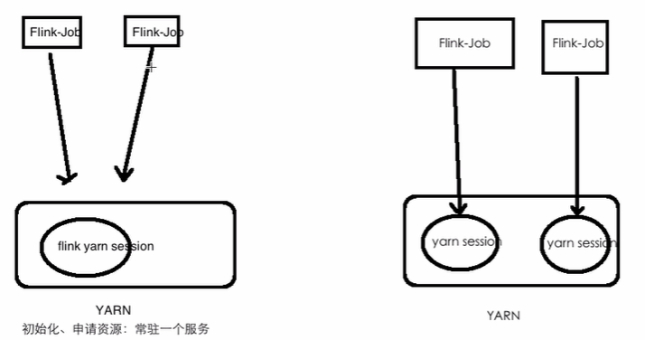

# Flink部署及作业提交

## Flink源码编译

### Setup: Download and Start Flink

Flink runs on **Linux, Mac OS X, and Windows**. To be able to run Flink, the only requirement is to have a working **Java 8.x** installation. Windows users, please take a look at the [Flink on Windows](https://ci.apache.org/projects/flink/flink-docs-release-1.7/tutorials/flink_on_windows.html) guide which describes how to run Flink on Windows for local setups.

You can check the correct installation of Java by issuing the following command:

```bash
java -version
```

If you have Java 8, the output will look something like this:

```bash
java version "1.8.0_111"
Java(TM) SE Runtime Environment (build 1.8.0_111-b14)
Java HotSpot(TM) 64-Bit Server VM (build 25.111-b14, mixed mode)
```

1. Download a binary from the [downloads page](http://flink.apache.org/downloads.html). You can pick any Hadoop/Scala combination you like. If you plan to just use the local file system, any Hadoop version will work fine.
2. Go to the download directory.
3. Unpack the downloaded archive.

```bash
$ cd ~/Downloads        # Go to download directory
$ tar xzf flink-*.tgz   # Unpack the downloaded archive
$ cd flink-1.7.2
```

通过下载Flink源码进行编译，不是使用直接下载二进制包
下载到:
	1）服务器：~/source  wget https://github.com/apache/flink/archive/release-1.7.0.tar.gz
	2) 本地：https://github.com/apache/flink/archive/release-1.7.0.tar.gz

```
mvn clean install -DskipTests -Pvendor-repos -Dfast -Dhadoop.version=2.6.0-cdh5.15.1
```

第一次编译是需要花费很长时间的，因为需要去中央仓库下载flink源码中所有的依赖包

## Standalone单机模式

Standalone的最简单的方式

```
./bin/flink run examples/streaming/SocketWindowWordCount.jar --port 9000
./bin/flink # 路径  $FLINK_HOME
```

### Start a Local Flink Cluster

```bash
$ ./bin/start-cluster.sh  # Start Flink
```

Check the **Dispatcher’s web frontend** at [http://localhost:8081](http://localhost:8081/) and make sure everything is up and running. The web frontend should report a single available TaskManager instance.

[](https://ci.apache.org/projects/flink/flink-docs-release-1.7/page/img/quickstart-setup/jobmanager-1.png)

You can also verify that the system is running by checking the log files in the `logs` directory:

```bash
$ tail log/flink-*-standalonesession-*.log
INFO ... - Rest endpoint listening at localhost:8081
INFO ... - http://localhost:8081 was granted leadership ...
INFO ... - Web frontend listening at http://localhost:8081.
INFO ... - Starting RPC endpoint for StandaloneResourceManager at akka://flink/user/resourcemanager .
INFO ... - Starting RPC endpoint for StandaloneDispatcher at akka://flink/user/dispatcher .
INFO ... - ResourceManager akka.tcp://flink@localhost:6123/user/resourcemanager was granted leadership ...
INFO ... - Starting the SlotManager.
INFO ... - Dispatcher akka.tcp://flink@localhost:6123/user/dispatcher was granted leadership ...
INFO ... - Recovering all persisted jobs.
INFO ... - Registering TaskManager ... under ... at the SlotManager.
```

### Read the Code

You can find the complete source code for this SocketWindowWordCount example in [scala](https://github.com/apache/flink/blob/master/flink-examples/flink-examples-streaming/src/main/scala/org/apache/flink/streaming/scala/examples/socket/SocketWindowWordCount.scala) and [java](https://github.com/apache/flink/blob/master/flink-examples/flink-examples-streaming/src/main/java/org/apache/flink/streaming/examples/socket/SocketWindowWordCount.java) on GitHub.

```java
public class SocketWindowWordCount {

    public static void main(String[] args) throws Exception {

        // the port to connect to
        final int port;
        try {
            final ParameterTool params = ParameterTool.fromArgs(args);
            port = params.getInt("port");
        } catch (Exception e) {
            System.err.println("No port specified. Please run 'SocketWindowWordCount --port <port>'");
            return;
        }

        // get the execution environment
        final StreamExecutionEnvironment env = StreamExecutionEnvironment.getExecutionEnvironment();

        // get input data by connecting to the socket
        DataStream<String> text = env.socketTextStream("localhost", port, "\n");

        // parse the data, group it, window it, and aggregate the counts
        DataStream<WordWithCount> windowCounts = text
            .flatMap(new FlatMapFunction<String, WordWithCount>() {
                @Override
                public void flatMap(String value, Collector<WordWithCount> out) {
                    for (String word : value.split("\\s")) {
                        out.collect(new WordWithCount(word, 1L));
                    }
                }
            })
            .keyBy("word")
            .timeWindow(Time.seconds(5), Time.seconds(1))
            .reduce(new ReduceFunction<WordWithCount>() {
                @Override
                public WordWithCount reduce(WordWithCount a, WordWithCount b) {
                    return new WordWithCount(a.word, a.count + b.count);
                }
            });

        // print the results with a single thread, rather than in parallel
        windowCounts.print().setParallelism(1);

        env.execute("Socket Window WordCount");
    }

    // Data type for words with count
    public static class WordWithCount {

        public String word;
        public long count;

        public WordWithCount() {}

        public WordWithCount(String word, long count) {
            this.word = word;
            this.count = count;
        }

        @Override
        public String toString() {
            return word + " : " + count;
        }
    }
}
```

### Run the Example

Now, we are going to run this Flink application. It will read text from a socket and once every 5 seconds print the number of occurrences of each distinct word during the previous 5 seconds, i.e. a tumbling window of processing time, as long as words are floating in.

- First of all, we use **netcat** to start local server via

```
$ nc -l 9000
```

- Submit the Flink program:

```
$ ./bin/flink run examples/streaming/SocketWindowWordCount.jar --port 9000
Starting execution of program
```

The program connects to the socket and waits for input. You can check the web interface to verify that the job is running as expected:

[](https://ci.apache.org/projects/flink/flink-docs-release-1.7/page/img/quickstart-setup/jobmanager-2.png)

[](https://ci.apache.org/projects/flink/flink-docs-release-1.7/page/img/quickstart-setup/jobmanager-3.png)

- Words are counted in time windows of 5 seconds (processing time, tumbling windows) and are printed to `stdout`. Monitor the TaskManager’s output file and write some text in `nc` (input is sent to Flink line by line after hitting ):

```
$ nc -l 9000
lorem ipsum
ipsum ipsum ipsum
bye
```

The `.out` file will print the counts at the end of each time window as long as words are floating in, e.g.:

```
$ tail -f log/flink-*-taskexecutor-*.out
lorem : 1
bye : 1
ipsum : 4
```

To **stop** Flink when you’re done type:

```
$ ./bin/stop-cluster.sh
```

## Standalone集群模式（独立集群）

This page provides instructions on how to run Flink in a *fully distributed fashion* on a *static* (but possibly heterogeneous) cluster.

- Java 1.8.x or higher

- ssh  多个机器之间要互通     Hadoop详细讲解

  ​	ping hadoop000
  ​	ping hadoop001
  ​	ping hadoop002

  ​	JDK
  ​	Flink  同一个目录  集群里面的机器 部署的目录都是一样	

  ​	每个机器需要添加ip和hostname的映射关系

- conf

  ​	flink-conf.yaml

  ​		jobmanager.rpc.address: 10.0.0.1  配置主节点的ip

  ​	jobmanager   主节点

  ​	taskmanager  从节点

  ​	slaves

  ​		每一行配置一个ip/host

- 常用配置
  - jobmanager.rpc.address   master节点的地址
  - jobmanager.heap.mb  jobmanager节点可用的内存
  - taskmanager.heap.mb taskmanager节点可用的内存
  - taskmanager.numberOfTaskSlots 每个机器可用的cpu个数
  - parallelism.default   任务的并行度
  - taskmanager.tmp.dirs  taskmanager的临时数据存储目录
- 扩展或者容错

### Requirements

#### Software Requirements

Flink runs on all *UNIX-like environments*, e.g. **Linux**, **Mac OS X**, and **Cygwin** (for Windows) and expects the cluster to consist of **one master node** and **one or more worker nodes**. Before you start to setup the system, make sure you have the following software installed **on each node**:

- **Java 1.8.x** or higher,
- **ssh** (sshd must be running to use the Flink scripts that manage remote components)

If your cluster does not fulfill these software requirements you will need to install/upgrade it.

Having **passwordless SSH** and **the same directory structure** on all your cluster nodes will allow you to use our scripts to control everything.

#### `JAVA_HOME` Configuration

Flink requires the `JAVA_HOME` environment variable to be set on the master and all worker nodes and point to the directory of your Java installation.

You can set this variable in `conf/flink-conf.yaml` via the `env.java.home` key.

### Flink Setup

Go to the [downloads page](https://flink.apache.org/downloads.html) and get the ready-to-run package. Make sure to pick the Flink package **matching your Hadoop version**. If you don’t plan to use Hadoop, pick any version.

After downloading the latest release, copy the archive to your master node and extract it:

```
tar xzf flink-*.tgz
cd flink-*
```

#### Configuring Flink

After having extracted the system files, you need to configure Flink for the cluster by editing *conf/flink-conf.yaml*.

Set the `jobmanager.rpc.address` key to point to your master node. You should also define the maximum amount of main memory Flink is allowed to allocate on each node by setting the `jobmanager.memory.process.size` and `taskmanager.memory.process.size` keys.

These values are given in MB. If some worker nodes have more main memory which you want to allocate to the Flink system you can overwrite the default value by setting setting `taskmanager.memory.process.size` or `taskmanager.memory.flink.size` in *conf/flink-conf.yaml* on those specific nodes.

Finally, you must provide a list of all nodes in your cluster that shall be used as worker nodes, i.e., nodes running a TaskManager. Edit the file *conf/workers* and enter the IP/host name of each worker node.

The following example illustrates the setup with three nodes (with IP addresses from *10.0.0.1* to *10.0.0.3* and hostnames *master*, *worker1*, *worker2*) and shows the contents of the configuration files (which need to be accessible at the same path on all machines):


/path/to/**flink/conf/
flink-conf.yaml**

```
jobmanager.rpc.address: 10.0.0.1
```

/path/to/**flink/
conf/workers**

```
10.0.0.2
10.0.0.3
```

The Flink directory must be available on every worker under the same path. You can use a shared NFS directory, or copy the entire Flink directory to every worker node.

Please see the [configuration page](https://ci.apache.org/projects/flink/flink-docs-release-1.11/zh/ops/config.html) for details and additional configuration options.

In particular,

- the amount of available memory per JobManager (`jobmanager.memory.process.size`),
- the amount of available memory per TaskManager (`taskmanager.memory.process.size` and check [memory setup guide](https://ci.apache.org/projects/flink/flink-docs-release-1.11/zh/ops/memory/mem_tuning.html#configure-memory-for-standalone-deployment)),
- the number of available CPUs per machine (`taskmanager.numberOfTaskSlots`),
- the total number of CPUs in the cluster (`parallelism.default`) and
- the temporary directories (`io.tmp.dirs`)

are very important configuration values.

#### Starting Flink

The following script starts a JobManager on the local node and connects via SSH to all worker nodes listed in the *workers* file to start the TaskManager on each node. Now your Flink system is up and running. The JobManager running on the local node will now accept jobs at the configured RPC port.

Assuming that you are on the master node and inside the Flink directory:

```
bin/start-cluster.sh
```

To stop Flink, there is also a `stop-cluster.sh` script.

#### Adding JobManager/TaskManager Instances to a Cluster

You can add both JobManager and TaskManager instances to your running cluster with the `bin/jobmanager.sh` and `bin/taskmanager.sh` scripts.

##### Adding a JobManager

```
bin/jobmanager.sh ((start|start-foreground) [host] [webui-port])|stop|stop-all
```

##### Adding a TaskManager

```
bin/taskmanager.sh start|start-foreground|stop|stop-all
```

Make sure to call these scripts on the hosts on which you want to start/stop the respective instance.

## YARN模式

ON YARN是企业级用的最多的方式



-n taskmanager的数量
-jm jobmanager的内存
-tm taskmanager的内存


./bin/flink run ./examples/batch/WordCount.jar \
-input hdfs://hadoop000:8020/LICENSE-2.0.txt \
-output hdfs://hadoop000:8020/wordcount-result.txt


./bin/flink run -m yarn-cluster -yn 1 ./examples/batch/WordCount.jar

### Quickstart

#### Start a long-running Flink cluster on YARN

Start a YARN session where the job manager gets 1 GB of heap space and the task managers 4 GB of heap space assigned:

```
# get the hadoop2 package from the Flink download page at
# http://flink.apache.org/downloads.html
curl -O <flink_hadoop2_download_url>
tar xvzf flink-1.7.2-bin-hadoop2.tgz
cd flink-1.7.2/
./bin/yarn-session.sh -jm 1024m -tm 4096m
```

Specify the `-s` flag for the number of processing slots per Task Manager. We recommend to set the number of slots to the number of processors per machine.

Once the session has been started, you can submit jobs to the cluster using the `./bin/flink` tool.

#### Run a Flink job on YARN

```
# get the hadoop2 package from the Flink download page at
# http://flink.apache.org/downloads.html
curl -O <flink_hadoop2_download_url>
tar xvzf flink-1.7.2-bin-hadoop2.tgz
cd flink-1.7.2/
./bin/flink run -m yarn-cluster -p 4 -yjm 1024m -ytm 4096m ./examples/batch/WordCount.jar
```

### Flink YARN Session

Apache [Hadoop YARN](http://hadoop.apache.org/) is a cluster resource management framework. It allows to run various distributed applications on top of a cluster. Flink runs on YARN next to other applications. Users do not have to setup or install anything if there is already a YARN setup.

**Requirements**

- at least Apache Hadoop 2.2
- HDFS (Hadoop Distributed File System) (or another distributed file system supported by Hadoop)

If you have troubles using the Flink YARN client, have a look in the [FAQ section](http://flink.apache.org/faq.html#yarn-deployment).

#### Start Flink Session

Follow these instructions to learn how to launch a Flink Session within your YARN cluster.

A session will start all required Flink services (JobManager and TaskManagers) so that you can submit programs to the cluster. Note that you can run multiple programs per session.

##### Download Flink

Download a Flink package for Hadoop >= 2 from the [download page](http://flink.apache.org/downloads.html). It contains the required files.

Extract the package using:

```
tar xvzf flink-1.7.2-bin-hadoop2.tgz
cd flink-1.7.2/
```

##### Start a Session

Use the following command to start a session

```
./bin/yarn-session.sh
```

This command will show you the following overview:

```
Usage:
   Optional
     -D <arg>                        Dynamic properties
     -d,--detached                   Start detached
     -jm,--jobManagerMemory <arg>    Memory for JobManager Container with optional unit (default: MB)
     -nm,--name                      Set a custom name for the application on YARN
     -q,--query                      Display available YARN resources (memory, cores)
     -qu,--queue <arg>               Specify YARN queue.
     -s,--slots <arg>                Number of slots per TaskManager
     -tm,--taskManagerMemory <arg>   Memory per TaskManager Container with optional unit (default: MB)
     -z,--zookeeperNamespace <arg>   Namespace to create the Zookeeper sub-paths for HA mode
```

-n taskmanager的数量
-jm jobmanager的内存
-tm taskmanager的内存

Please note that the Client requires the `YARN_CONF_DIR` or `HADOOP_CONF_DIR` environment variable to be set to read the YARN and HDFS configuration.

**Example:** Issue the following command to start a Yarn session cluster where each task manager is started with 8 GB of memory and 32 processing slots:

```
./bin/yarn-session.sh -tm 8192 -s 32
```

The system will use the configuration in `conf/flink-conf.yaml`. Please follow our [configuration guide](https://ci.apache.org/projects/flink/flink-docs-release-1.7/ops/config.html) if you want to change something.

Flink on YARN will overwrite the following configuration parameters `jobmanager.rpc.address` (because the JobManager is always allocated at different machines), `io.tmp.dirs` (we are using the tmp directories given by YARN) and `parallelism.default` if the number of slots has been specified.

If you don’t want to change the configuration file to set configuration parameters, there is the option to pass dynamic properties via the `-D` flag. So you can pass parameters this way: `-Dfs.overwrite-files=true -Dtaskmanager.network.memory.min=536346624`.

The example invocation starts a single container for the ApplicationMaster which runs the Job Manager.

The session cluster will automatically allocate additional containers which run the Task Managers when jobs are submitted to the cluster.

Once Flink is deployed in your YARN cluster, it will show you the connection details of the Job Manager.

Stop the YARN session by stopping the unix process (using CTRL+C) or by entering ‘stop’ into the client.

Flink on YARN will only start if enough resources are available for the ApplicationMaster on the cluster. Most YARN schedulers account for the requested memory of the containers, some account also for the number of vcores. By default, the number of vcores is equal to the processing slots (`-s`) argument. The [`yarn.containers.vcores`](https://ci.apache.org/projects/flink/flink-docs-release-1.7/ops/config.html#yarn-containers-vcores) allows overwriting the number of vcores with a custom value. In order for this parameter to work you should enable CPU scheduling in your cluster.

##### Detached YARN Session

If you do not want to keep the Flink YARN client running all the time, it’s also possible to start a *detached* YARN session. The parameter for that is called `-d` or `--detached`.

In that case, the Flink YARN client will only submit Flink to the cluster and then close itself. Note that in this case its not possible to stop the YARN session using Flink.

Use the YARN utilities (`yarn application -kill <appId>`) to stop the YARN session.

##### Attach to an existing Session

Use the following command to start a session

```
./bin/yarn-session.sh
```

This command will show you the following overview:

```
Usage:
   Required
     -id,--applicationId <yarnAppId> YARN application Id
```

As already mentioned, `YARN_CONF_DIR` or `HADOOP_CONF_DIR` environment variable must be set to read the YARN and HDFS configuration.

**Example:** Issue the following command to attach to running Flink YARN session `application_1463870264508_0029`:

```
./bin/yarn-session.sh -id application_1463870264508_0029
```

Attaching to a running session uses YARN ResourceManager to determine Job Manager RPC port.

Stop the YARN session by stopping the unix process (using CTRL+C) or by entering ‘stop’ into the client.

#### Submit Job to Flink

Use the following command to submit a Flink program to the YARN cluster:

```
./bin/flink
```

Please refer to the documentation of the [command-line client](https://ci.apache.org/projects/flink/flink-docs-release-1.7/ops/cli.html).

The command will show you a help menu like this:

```
[...]
Action "run" compiles and runs a program.

  Syntax: run [OPTIONS] <jar-file> <arguments>
  "run" action arguments:
     -c,--class <classname>           Class with the program entry point ("main"
                                      method or "getPlan()" method. Only needed
                                      if the JAR file does not specify the class
                                      in its manifest.
     -m,--jobmanager <host:port>      Address of the JobManager (master) to
                                      which to connect. Use this flag to connect
                                      to a different JobManager than the one
                                      specified in the configuration.
     -p,--parallelism <parallelism>   The parallelism with which to run the
                                      program. Optional flag to override the
                                      default value specified in the
                                      configuration
```

Use the *run* action to submit a job to YARN. The client is able to determine the address of the JobManager. In the rare event of a problem, you can also pass the JobManager address using the `-m` argument. The JobManager address is visible in the YARN console.

**Example**

```
wget -O LICENSE-2.0.txt http://www.apache.org/licenses/LICENSE-2.0.txt
hadoop fs -copyFromLocal LICENSE-2.0.txt hdfs:/// ...
./bin/flink run ./examples/batch/WordCount.jar \
        hdfs:///..../LICENSE-2.0.txt hdfs:///.../wordcount-result.txt
```

If there is the following error, make sure that all TaskManagers started:

```
Exception in thread "main" org.apache.flink.compiler.CompilerException:
    Available instances could not be determined from job manager: Connection timed out.
```

You can check the number of TaskManagers in the JobManager web interface. The address of this interface is printed in the YARN session console.

If the TaskManagers do not show up after a minute, you should investigate the issue using the log files.

### Run a single Flink job on YARN

The documentation above describes how to start a Flink cluster within a Hadoop YARN environment. It is also possible to launch Flink within YARN only for executing a single job.

***Example:\***

```
./bin/flink run -m yarn-cluster ./examples/batch/WordCount.jar
```

The command line options of the YARN session are also available with the `./bin/flink` tool. They are prefixed with a `y` or `yarn` (for the long argument options).

Note: You can use a different configuration directory per job by setting the environment variable `FLINK_CONF_DIR`. To use this copy the `conf` directory from the Flink distribution and modify, for example, the logging settings on a per-job basis.

Note: It is possible to combine `-m yarn-cluster` with a detached YARN submission (`-yd`) to “fire and forget” a Flink job to the YARN cluster. In this case, your application will not get any accumulator results or exceptions from the ExecutionEnvironment.execute() call!

#### User jars & Classpath

By default Flink will include the user jars into the system classpath when running a single job. This behavior can be controlled with the `yarn.per-job-cluster.include-user-jar` parameter.

When setting this to `DISABLED` Flink will include the jar in the user classpath instead.

The user-jars position in the class path can be controlled by setting the parameter to one of the following:

- `ORDER`: (default) Adds the jar to the system class path based on the lexicographic order.
- `FIRST`: Adds the jar to the beginning of the system class path.
- `LAST`: Adds the jar to the end of the system class path.

### Recovery behavior of Flink on YARN

Flink’s YARN client has the following configuration parameters to control how to behave in case of container failures. These parameters can be set either from the `conf/flink-conf.yaml` or when starting the YARN session, using `-D` parameters.

- `yarn.application-attempts`: The number of ApplicationMaster (+ its TaskManager containers) attempts. If this value is set to 1 (default), the entire YARN session will fail when the Application master fails. Higher values specify the number of restarts of the ApplicationMaster by YARN.

### Debugging a failed YARN session

There are many reasons why a Flink YARN session deployment can fail. A misconfigured Hadoop setup (HDFS permissions, YARN configuration), version incompatibilities (running Flink with vanilla Hadoop dependencies on Cloudera Hadoop) or other errors.

#### Log Files

In cases where the Flink YARN session fails during the deployment itself, users have to rely on the logging capabilities of Hadoop YARN. The most useful feature for that is the [YARN log aggregation](http://hortonworks.com/blog/simplifying-user-logs-management-and-access-in-yarn/). To enable it, users have to set the `yarn.log-aggregation-enable` property to `true` in the `yarn-site.xml` file. Once that is enabled, users can use the following command to retrieve all log files of a (failed) YARN session.

```
yarn logs -applicationId <application ID>
```

Note that it takes a few seconds after the session has finished until the logs show up.

#### YARN Client console & Web interfaces

The Flink YARN client also prints error messages in the terminal if errors occur during runtime (for example if a TaskManager stops working after some time).

In addition to that, there is the YARN Resource Manager web interface (by default on port 8088). The port of the Resource Manager web interface is determined by the `yarn.resourcemanager.webapp.address` configuration value.

It allows to access log files for running YARN applications and shows diagnostics for failed apps.

### Build YARN client for a specific Hadoop version

Users using Hadoop distributions from companies like Hortonworks, Cloudera or MapR might have to build Flink against their specific versions of Hadoop (HDFS) and YARN. Please read the [build instructions](https://ci.apache.org/projects/flink/flink-docs-release-1.7/flinkDev/building.html) for more details.

### Running Flink on YARN behind Firewalls

Some YARN clusters use firewalls for controlling the network traffic between the cluster and the rest of the network. In those setups, Flink jobs can only be submitted to a YARN session from within the cluster’s network (behind the firewall). If this is not feasible for production use, Flink allows to configure the port for its REST endpoint, used for the client-cluster communication. With this port configured, users can also submit jobs to Flink crossing the firewall.

The configuration parameter for specifying the REST endpoint port is the following:

- `rest.port`

This configuration option accepts single ports (for example: “50010”).

(Hadoop is using a similar mechanism, there the configuration parameter is called `yarn.app.mapreduce.am.job.client.port-range`.)

### Background / Internals

This section briefly describes how Flink and YARN interact.


The YARN client needs to access the Hadoop configuration to connect to the YARN resource manager and to HDFS. It determines the Hadoop configuration using the following strategy:

YARN客户端需要访问Hadoop配置以连接到YARN资源管理器和HDFS。 它使用以下策略确定Hadoop配置：

- Test if `YARN_CONF_DIR`, `HADOOP_CONF_DIR` or `HADOOP_CONF_PATH` are set (in that order). If one of these variables are set, they are used to read the configuration.
- 测试是否设置了“ YARN_CONF_DIR”，“ HADOOP_CONF_DIR”或“ HADOOP_CONF_PATH”（按顺序）。 如果设置了这些变量之一，则将其用于读取配置。
- If the above strategy fails (this should not be the case in a correct YARN setup), the client is using the `HADOOP_HOME` environment variable. If it is set, the client tries to access `$HADOOP_HOME/etc/hadoop` (Hadoop 2) and `$HADOOP_HOME/conf` (Hadoop 1).
- 如果上述策略失败（在正确的YARN设置中不应该是这种情况），则客户端使用的是HADOOP_HOME环境变量。 如果已设置，则客户端尝试访问`$ HADOOP_HOME/etc/hadoop`（Hadoop 2）和`$ HADOOP_HOME/conf`（Hadoop 1）。

When starting a new Flink YARN session, the client first checks if the requested resources (memory and vcores for the ApplicationMaster) are available. After that, it uploads a jar that contains Flink and the configuration to HDFS (step 1).

在启动新的Flink YARN会话时，客户端首先检查所请求的资源（ApplicationMaster的内存和vcore）是否可用。 之后，它将包含Flink和配置的jar上传到HDFS（步骤1）。

The next step of the client is to request (step 2) a YARN container to start the *ApplicationMaster* (step 3). Since the client registered the configuration and jar-file as a resource for the container, the NodeManager of YARN running on that particular machine will take care of preparing the container (e.g. downloading the files). Once that has finished, the *ApplicationMaster* (AM) is started.

客户端的下一步是请求YARN容器（步骤2）以启动*ApplicationMaster*（步骤3）。由于客户端将配置和jar文件注册为容器的资源，因此在该特定计算机上运行的YARN的NodeManager将负责准备容器（例如下载文件）。完成后，将启动*ApplicationMaster*（AM）。

The *JobManager* and AM are running in the same container. Once they successfully started, the AM knows the address of the JobManager (its own host). It is generating a new Flink configuration file for the TaskManagers (so that they can connect to the JobManager). The file is also uploaded to HDFS. Additionally, the *AM* container is also serving Flink’s web interface. All ports the YARN code is allocating are *ephemeral ports*. This allows users to execute multiple Flink YARN sessions in parallel.

*JobManager*和AM在同一容器中运行。一旦成功启动，AM就会知道JobManager（自己的主机）的地址。 它正在为TaskManager生成一个新的Flink配置文件（以便它们可以连接到JobManager）。该文件也上传到HDFS。此外，*AM*容器还提供Flink的网络界面。YARN代码分配的所有端口都是*临时端口*。 这使用户可以并行执行多个Flink YARN会话。

After that, the AM starts allocating the containers for Flink’s TaskManagers, which will download the jar file and the modified configuration from the HDFS. Once these steps are completed, Flink is set up and ready to accept Jobs.

之后，AM开始为Flink的TaskManager分配容器，这些任务管理器将从HDFS下载jar文件和修改后的配置。 这些步骤完成后，就建立了Flink并准备接受Jobs。

