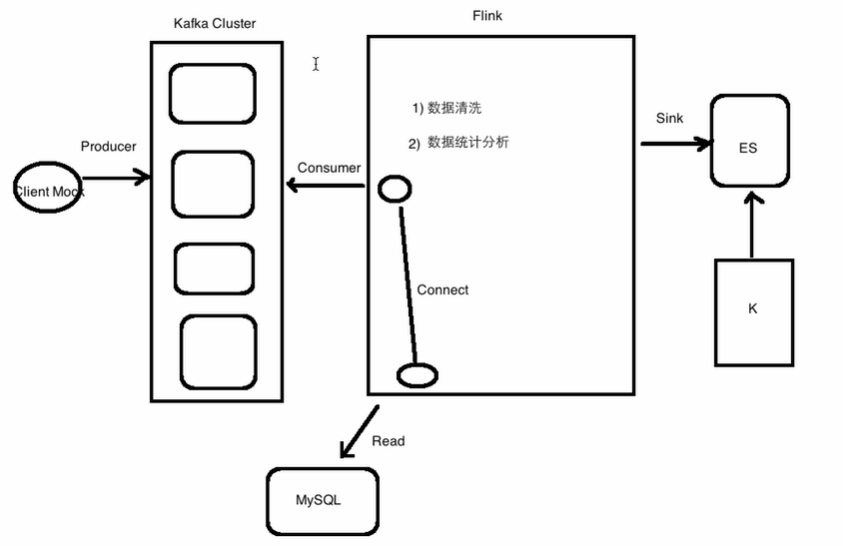
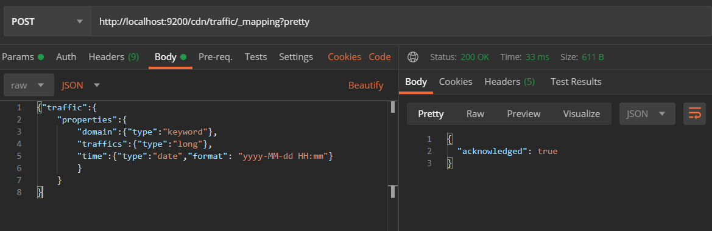

# Flink项目实战

## 项目背景

```log
aliyun	CN	A	E	[17/Jul/2018:17:07:50 +0800]	2	223.104.18.110	-	112.
29.213.35:80	0	v2.go2yd.com	GET	http://v1.go2yd.com/user_upload/1531633977627104fdec
dc68fe7a2c4b96b2226fd3f4c.mp4_bd.mp4	HTTP/1.1	-	bytes 13869056-13885439/25136186	TCP_HIT/206	112.29.213.35	video/mp4	17168	16384	-:0	0	0	-	-	11451601	-	"JSP3/2.0.14"	"-"	"-"	"-"	http	-	2	v1.g
o2yd.com	0.002	25136186	16384	-	-	-	-	-	-	-	1531818470104-114516
01-112.29.213.66#2705261172	644514568
```

- aliyun	
- CN 	
- E
- [17/Jul/2018:17:07:50 +0800]
- 223.104.18.110
- v2.go2yd.com
- 17168

接入的数据类型就是日志
离线：Flume==>HDFS
实时：Kafka==>流处理引擎==>ES==>Kibana

项目功能
1）统计一分钟内每个域名访问产生的流量
	Flink接收Kafka的进行处理
2）统计一分钟内每个用户产生的流量
	域名和用户是有对应关系的
	Flink接收Kafka的进行 + Flink读取域名和用户的配置数据  进行处理

## 功能描述

- 统计一分钟内每个域名访问产生的流量

  ​	Flink接收Kafka的进行处理

- 统计一分钟内每个用户产生的流量

  ​	域名和用户是有对应关系的

  ​	Flink接收Kafka的进行 + Flink读取域名和用户的配置数据  进行处理

- 数据：Mock 

## 项目架构



## 功能实现

### 需求

Mock数据：

```
tencent	CN	E	2020-07-21 22:15:02	117.59.39.169	ml.qq.com	867	
tencent	CN	M	2020-07-21 22:15:04	183.227.58.21	pv3.myapp.com	8953	
tencent	CN	E	2020-07-21 22:15:06	175.148.211.190	pv.tqqt.com	1149	
tencent	CN	E	2020-07-21 22:15:08	117.59.39.169	pv2.weqn.com	497	
tencent	CN	M	2020-07-21 22:15:10	112.1.66.34	pvp.qq.com	468	
tencent	CN	E	2020-07-21 22:15:12	59.83.198.84	pv.tqqt.com	5125	
tencent	CN	E	2020-07-21 22:15:14	183.225.139.16	v.qq.com	4061	
tencent	CN	M	2020-07-21 22:15:16	183.227.58.21	im.qq.com	7606	
tencent	CN	M	2020-07-21 22:15:18	113.101.75.194	3q.qq.com	3871	
tencent	CN	E	2020-07-21 22:15:20	223.104.18.110	pv2.weqn.com	9189	
tencent	CN	E	2020-07-21 22:15:22	223.104.18.110	pvp.qq.com	4557	
```

- 需求一：最近一分钠每个域名对应的流量

- 需求二：CDN业务，userId，一个用户对应多个域名，存在用户id和域名的映射关系，还需要从另外一个表（MySQL）中去获取userId和domain的映射关系。

```SQL
CREATE TABLE `user_domain_config` (
  `id` int(11) NOT NULL AUTO_INCREMENT,
  `user_id` varchar(40) NOT NULL,
  `domain` varchar(255) NOT NULL,
  PRIMARY KEY (`id`)
) ENGINE=InnoDB DEFAULT CHARSET=utf8mb4;
```

```SQL
use flink;
insert into user_domain_config(user_id,domain) values('8000000','pvp.qq.com');
insert into user_domain_config(user_id,domain) values('8000000','im.qq.com');
insert into user_domain_config(user_id,domain) values('8000000','ml.qq.com');
insert into user_domain_config(user_id,domain) values('8000000','v.qq.com');
insert into user_domain_config(user_id,domain) values('8000000','3q.qq.com');
insert into user_domain_config(user_id,domain) values('6600000','pv.tqqt.com');
insert into user_domain_config(user_id,domain) values('6600000','pv2.weqn.com');
insert into user_domain_config(user_id,domain) values('6600000','pv3.myapp.com');
```

在做实时数据清洗的时候，不仅仅需要处理raw日志，还需要关联MySQL表里的数据

自定义一个Flink读取MySQL数据的数据源，然后把两个Stream关联起来。


### Flink sink至 elasticsearch

1. 建立cdn的index

   ```
   curl - XPUT 'http://hadoop000:9200/cdn'
   ```

2. 新建数据索引

   ```
   curl -H "Content-Type: application/json" -XPOST 
   
   'http://hadoop000:9200/cdn/traffic/_mapping?pretty' -d '{
   "traffic":{
   	"properties":{
   		"domain":{"type":"keyword"},
   		"traffics":{"type":"long"},
   		"time":{"type":"date","format": "yyyy-MM-dd HH:mm"}
   		}
       }
   }
   ```

   

### 代码实现

```scala
package org.tyrael.flink.project

import java.text.SimpleDateFormat
import java.util.{Date, Properties}

import org.apache.flink.api.common.functions.RuntimeContext
import org.apache.flink.api.java.tuple.Tuple
import org.apache.flink.streaming.api.TimeCharacteristic
import org.apache.flink.streaming.api.functions.AssignerWithPeriodicWatermarks
import org.apache.flink.streaming.api.scala.StreamExecutionEnvironment
import org.apache.flink.streaming.api.scala._
import org.apache.flink.streaming.api.scala.function.WindowFunction
import org.apache.flink.streaming.api.watermark.Watermark
import org.apache.flink.streaming.api.windowing.assigners.TumblingEventTimeWindows
import org.apache.flink.streaming.api.windowing.time.Time
import org.apache.flink.streaming.api.windowing.windows.TimeWindow
import org.apache.flink.streaming.connectors.elasticsearch.{ElasticsearchSinkFunction, RequestIndexer}
import org.apache.flink.streaming.connectors.elasticsearch6.ElasticsearchSink
import org.apache.flink.streaming.connectors.kafka.FlinkKafkaConsumer
import org.apache.flink.streaming.util.serialization.SimpleStringSchema
import org.apache.flink.util.Collector
import org.apache.http.HttpHost
import org.elasticsearch.action.index.IndexRequest
import org.elasticsearch.client.Requests
import org.slf4j.LoggerFactory

import scala.collection.mutable.ArrayBuffer

object LogAnalysis {

  def main(args: Array[String]): Unit = {
    val logger = LoggerFactory.getLogger("LogAnalysis")

    val env = StreamExecutionEnvironment.getExecutionEnvironment
    env.setStreamTimeCharacteristic(TimeCharacteristic.EventTime)

    val topic = "tyraeltest"
    val properties = new Properties()
    properties.setProperty("bootstrap.servers", "10.40.155.50:9092")
    properties.setProperty("group.id", "test")

    // 接收kafka数据
    val data = env.addSource(new FlinkKafkaConsumer[String](topic, new SimpleStringSchema(), properties))

    val logData = data.map(x => {
      val splits = x.split("\t")
      val level = splits(2)
      val timeStr = splits(3)

      var time = 0l

      try {
        val sourceFormat = new SimpleDateFormat("yyyy-MM-dd HH:mm:ss")
        time = sourceFormat.parse(timeStr).getTime
      } catch {
        case e: Exception => {
          logger.error(s"time parse error: $timeStr" + e.getMessage)
        }
      }
      val domain = splits(5)
      val traffic = splits(6).toLong

      (level, time, domain, traffic)
    }).filter(_._2 != 0).filter(_._1 == "E")
      .map(x => {
        (x._2, x._3, x._4)
      })

    /**
     * 在生产上进行业务处理的时候，一定要考虑处理的健壮性以及你数据的准确性
     * 脏数据或者是不符合业务规则的数据是需要全部过滤掉之后
     * 再进行相应业务逻辑的处理
     *
     * 对于我们的业务来说，我们只需要统计level=E的即可
     * 对于level非E的，不做为我们业务指标的统计范畴
     *
     * 数据清洗：就是按照我们的业务规则把原始输入的数据进行一定业务规则的处理
     * 使得满足我们的业务需求为准
     */

    val resultData = logData.assignTimestampsAndWatermarks(new AssignerWithPeriodicWatermarks[(Long,String,Long)]{

      val maxOutOfOrderness = 10000L // 3.5 seconds

      var currentMaxTimestamp: Long = _

      override def getCurrentWatermark: Watermark = {
        new Watermark(currentMaxTimestamp - maxOutOfOrderness)
      }

      override def extractTimestamp(element: (Long, String, Long), previousElementTimestamp: Long): Long = {
        val timestamp = element._1
        currentMaxTimestamp = Math.max(timestamp, currentMaxTimestamp)
        timestamp
      }
    }).keyBy(1) //此处是按照域名进行keyBy的
      .window(TumblingEventTimeWindows.of(Time.seconds(60)))
      .apply(new WindowFunction[(Long,String,Long),(String,String,Long),Tuple, TimeWindow] {
        override def apply(key: Tuple, window: TimeWindow, input: Iterable[(Long, String, Long)], out: Collector[(String, String, Long)]): Unit = {

          val domain = key.getField(0).toString
          var sum = 0l

          val times = ArrayBuffer[Long]()

          val iterator = input.iterator
          while(iterator.hasNext) {
            val next = iterator.next()
            sum += next._3  // traffic求和

            // TODO... 是能拿到你这个window里面的时间的  next._1
            times.append(next._1)
          }

          /**
           *  第一个参数：这一分钟的时间 2019-09-09 20:20
           *  第二个参数：域名
           *  第三个参数：traffic的和
           */
          val time = new SimpleDateFormat("yyyy-MM-dd HH:mm").format(new Date(times.max))
          out.collect((time,domain,sum))
        }
      })


    val httpHosts = new java.util.ArrayList[HttpHost]
    httpHosts.add(new HttpHost("127.0.0.1", 9200, "http"))

    val esSinkBuilder = new ElasticsearchSink.Builder[(String, String, Long)](
      httpHosts,
      new ElasticsearchSinkFunction[(String, String, Long)] {
        def process(element: (String, String, Long), ctx: RuntimeContext, indexer: RequestIndexer) {
          val json = new java.util.HashMap[String, Any]
          json.put("time", element._1)
          json.put("domain", element._2)
          json.put("traffics", element._3)

          val id = element._1 + "-" + element._2

          val rqst: IndexRequest = Requests.indexRequest
            .index("cdn")
            .`type`("traffic")
            .id(id)
            .source(json)

          indexer.add(rqst)
        }
      }
    )
    esSinkBuilder.setBulkFlushMaxActions(1)

    resultData.addSink(esSinkBuilder.build)
    resultData.print()

    env.execute("LogAnalysis")
  }

}

```

```scala
package org.tyrael.flink.project

import java.text.SimpleDateFormat
import java.util
import java.util.{Date, Properties}

import org.apache.flink.api.common.functions.RuntimeContext
import org.apache.flink.api.java.tuple.Tuple
import org.apache.flink.streaming.api.TimeCharacteristic
import org.apache.flink.streaming.api.functions.AssignerWithPeriodicWatermarks
import org.apache.flink.streaming.api.functions.co.CoFlatMapFunction
import org.apache.flink.streaming.api.scala.{StreamExecutionEnvironment, _}
import org.apache.flink.streaming.api.scala.function.WindowFunction
import org.apache.flink.streaming.api.watermark.Watermark
import org.apache.flink.streaming.api.windowing.assigners.TumblingEventTimeWindows
import org.apache.flink.streaming.api.windowing.time.Time
import org.apache.flink.streaming.api.windowing.windows.TimeWindow
import org.apache.flink.streaming.connectors.kafka.FlinkKafkaConsumer
import org.apache.flink.streaming.util.serialization.SimpleStringSchema
import org.apache.flink.util.Collector
import org.slf4j.LoggerFactory

import scala.collection.mutable
import scala.collection.mutable.ArrayBuffer

object LogAnalysis02 {

  def main(args: Array[String]): Unit = {
    val logger = LoggerFactory.getLogger("LogAnalysis02")

    val env = StreamExecutionEnvironment.getExecutionEnvironment
    env.setStreamTimeCharacteristic(TimeCharacteristic.EventTime)

    val topic = "tyraeltest"
    val properties = new Properties()
    properties.setProperty("bootstrap.servers", "10.40.155.50:9092")
    properties.setProperty("group.id", "test")

    // 接收kafka数据
    val data = env.addSource(new FlinkKafkaConsumer[String](topic, new SimpleStringSchema(), properties))

    val logData = data.map(x => {
      val splits = x.split("\t")
      val level = splits(2)
      val timeStr = splits(3)

      var time = 0l

      try {
        val sourceFormat = new SimpleDateFormat("yyyy-MM-dd HH:mm:ss")
        time = sourceFormat.parse(timeStr).getTime
      } catch {
        case e: Exception => {
          logger.error(s"time parse error: $timeStr" + e.getMessage)
        }
      }
      val domain = splits(5)
      val traffic = splits(6).toLong

      (level, time, domain, traffic)
    }).filter(_._2 != 0).filter(_._1 == "E")
      .map(x => {
        (x._2, x._3, x._4)
      })

    /**
     * 在生产上进行业务处理的时候，一定要考虑处理的健壮性以及你数据的准确性
     * 脏数据或者是不符合业务规则的数据是需要全部过滤掉之后
     * 再进行相应业务逻辑的处理
     *
     * 对于我们的业务来说，我们只需要统计level=E的即可
     * 对于level非E的，不做为我们业务指标的统计范畴
     *
     * 数据清洗：就是按照我们的业务规则把原始输入的数据进行一定业务规则的处理
     * 使得满足我们的业务需求为准
     */

    val mysqlData = env.addSource(new TyraelMySQLSource)
    //    mysqlData.print()
    val connectData = logData.connect(mysqlData)
      .flatMap(new CoFlatMapFunction[(Long, String, Long), mutable.HashMap[String, String], String] {

        var userDomainMap = mutable.HashMap[String, String]()

        // log
        override def flatMap1(value: (Long, String, Long), out: Collector[String]): Unit = {
          val domain = value._2
          val userId = userDomainMap.getOrElse(domain, "")

          //          println("~~~~~~~~~~~~~" + userId)

          out.collect(value._1 + "\t" + value._2 + "\t" + value._3 + "\t" + userId)
        }

        // MySQL
        override def flatMap2(value: mutable.HashMap[String, String], out: Collector[String]): Unit = {
          userDomainMap = value
        }
      })
    connectData.print()
    val connect = connectData.map(x => {
      val splits = x.split("\t")
      val time = splits(0).toLong
      println(time)
      val traffic = splits(2).toLong
      val userId = splits(3).toLong
      (time, traffic, userId)
    })

    // 1595506219000	v.qq.com	9370	8000000
    val resultData = connect.assignTimestampsAndWatermarks(new AssignerWithPeriodicWatermarks[(Long, Long, Long)] {

      val maxOutOfOrderness = 10000L // 3.5 seconds

      var currentMaxTimestamp: Long = _

      override def getCurrentWatermark: Watermark = {
        new Watermark(currentMaxTimestamp - maxOutOfOrderness)
      }

      override def extractTimestamp(element: (Long, Long, Long), previousElementTimestamp: Long): Long = {
        val timestamp = element._1
        currentMaxTimestamp = Math.max(timestamp, currentMaxTimestamp)
        timestamp
      }
    })

    resultData.print()

    val value = resultData.keyBy(2)
    value.print()
    val value1 = value // 此处按照域名进行keyBy
      .window(TumblingEventTimeWindows.of(Time.seconds(5)))
      .apply(new WindowFunction[(Long, Long, Long), (String, Long, Long), Tuple, TimeWindow] {
        override def apply(key: Tuple, window: TimeWindow, input: Iterable[(Long, Long, Long)], out: Collector[(String, Long, Long)]): Unit = {

          val userId = key.getField(2)
          var sum = 0l

          val times = ArrayBuffer[Long]()

          val iterator = input.iterator
          while(iterator.hasNext){
            val next = iterator.next()
            sum += next._2

            times.append(next._1)
          }
          val time = new SimpleDateFormat("yyyy-MM-dd HH:mm").format(new Date(times.max))
          out.collect((time,userId,sum))
        }
      })

    value1.print()

    env.execute("LogAnalysis02")
  }

}

```

### 存在问题

1. 将Kafka流与维度表相结合的时候，window窗口没有进去