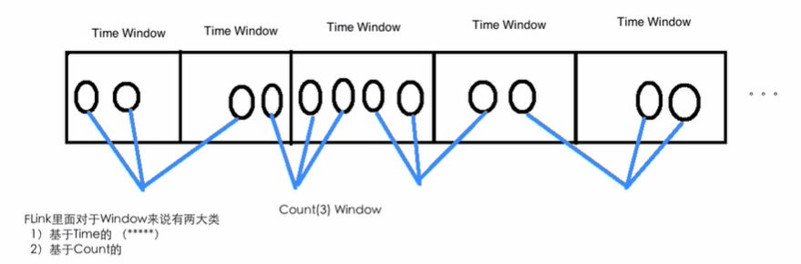

# Flink中的Time及Windows的使用

## Flink中的Time类型

### Event Time / Processing Time / Ingestion Time

Flink supports different notions of *time* in streaming programs.

Flink在流媒体程序中支持“时间”的不同概念。


对于Flink里面的三种时间：

- **事件时间**

  **事件时间（**Event time:**）：**事件时间是指每个事件在其生产设备上发生的时间。 通常在记录进入Flink之前将其嵌入到记录中，并且可以从每个记录中提取事件时间戳。 在事件时间中，时间的进度取决于数据，而不取决于任何挂钟。 使用事件时间的程序必须指定如何生成*事件时间水印*，这是信号事件时间进展的机制。 

  在理想情况下，事件时间处理将产生**完全一致且确定**的结果，而不管事件何时到达或它们的顺序如何。 但是，除非已知事件是按时间戳（按时间戳）到达的，否则事件时间处理会在等待无序事件时产生一些延迟。 由于只能等待有限的时间，因此这**限制了**确定性事件时间应用程序的**可用性**。

  假设所有数据都已到达，事件时间操作将按预期方式运行，即使在处理无序或迟到事件或重新处理历史数据时，也会产生正确且一致的结果。 例如，无论它们到达的顺序或处理的时间，每小时事件时间窗口会将包含所有带有落入该小时事件时间戳的记录。

  请注意，有时当事件时间程序实时处理实时数据时，它们将使用一些“处理时间”操作，以确保它们及时进行。

- **摄取时间**

  **摄取时间：**摄取时间是事件进入Flink的时间。 在源操作员处，每条记录都将源的当前时间作为时间戳记，并且基于时间的操作（例如时间窗口）引用该时间戳记。

  *摄取时间*在概念上位于*事件时间*和*处理时间*之间。 与*处理时间*相比，它稍微贵一点，但结果却更可预测。 由于*摄取时间*使用稳定的时间戳（在源处分配了一次），因此对记录的不同窗口操作将引用相同的时间戳，而在*处理时间*中，每个窗口操作员都可以将记录分配给不同的窗口（基于 本地系统时钟和任何传输延迟）。

  与“事件时间”相比，“摄入时间”程序不能处理任何乱序事件或迟到的数据，但是程序不必指定如何生成“水印”。

  在内部，“摄取时间”与“事件时间”非常相似，但是具有自动时间戳分配和自动水印生成功能。

- **处理时间**

  **处理时间：**处理时间是指执行相应操作的机器的系统时间。

  当流式程序按处理时间运行时，所有基于时间的操作（如时间窗口）都将使用运行该操作的**计算机系统时钟**。 每小时处理时间窗口将包括系统时钟指示整小时的时间之间到达特定操作的所有记录。 例如，如果应用程序在9:15 am开始运行，则第一个每小时处理时间窗口将包括在9:15 am和10:00 am之间处理的事件，下一个窗口将包括在10:00 am和11:00 am之间处理的事件，依此类推。

  处理时间是最简单的时间概念，不需要流和机器之间的协调。 它提供了**最佳的性能**和**最低的延迟**。 但是，在**分布式和异步环境**中，**处理时间不能提供确定性**，因为它容易受到**记录到达系统的速度**（例如，从消息队列中来），记录在系统内部的操作员之间流动的速度以及中断（计划的或其他方式）的影响。

### Setting a Time Characteristic设置时间特征

Flink DataStream程序的第一部分通常设置基本的*时间特征*。 该设置定义了数据流源的行为方式（例如，它们是否会分配时间戳），以及诸如`KeyedStream.timeWindow(Time.seconds(30))`之类的窗口操作应使用什么时间概念。

以下示例显示了一个Flink程序，该程序在每小时的时间窗口中汇总事件。 窗口的行为与时间特征相适应。

```java
final StreamExecutionEnvironment env = StreamExecutionEnvironment.getExecutionEnvironment();

env.setStreamTimeCharacteristic(TimeCharacteristic.ProcessingTime);

// alternatively:
// env.setStreamTimeCharacteristic(TimeCharacteristic.IngestionTime);
// env.setStreamTimeCharacteristic(TimeCharacteristic.EventTime);

DataStream<MyEvent> stream = env.addSource(new FlinkKafkaConsumer09<MyEvent>(topic, schema, props));

stream
    .keyBy( (event) -> event.getUser() )
    .timeWindow(Time.hours(1))
    .reduce( (a, b) -> a.add(b) )
    .addSink(...);
```

请注意，为了在事件时间中运行此示例，程序需要使用直接为数据定义事件时间并自己发出水印的源，或者程序必须在源之后注入Timestamp Assigner＆Watermark Generator。 这些功能描述了如何访问事件时间戳，以及事件流表现出的乱序程度。

以下部分描述了时间戳和水印背后的一般机制。 

## Flink中的Windows编程

Windows是处理无限流的核心。 Windows将流分成有限大小的“存储桶”，我们可以在桶上进行计算。 本文档重点介绍如何在Flink中执行窗口化，以及程序员如何从其提供的功能中获得最大收益。

The general structure of a windowed Flink program is presented below. The first snippet refers to *keyed* streams, while the second to *non-keyed* ones. As one can see, the only difference is the `keyBy(...)` call for the keyed streams and the `window(...)` which becomes `windowAll(...)` for non-keyed streams. This is also going to serve as a roadmap for the rest of the page.

窗口式Flink程序的一般结构如下所示。第一段代码使用可*keyBy流*，而第二段代码使用*non-keyed流*，可以看到，唯一的区别是对键控流进行了“ keyBy（...）”调用，对非键控流进行了“ window（...）”更改为“ windowAll（...）”。

**Keyed Windows**

```
stream
       .keyBy(...)               <-  keyed versus non-keyed windows
       .window(...)              <-  required: "assigner"
      [.trigger(...)]            <-  optional: "trigger" (else default trigger)
      [.evictor(...)]            <-  optional: "evictor" (else no evictor)
      [.allowedLateness(...)]    <-  optional: "lateness" (else zero)
      [.sideOutputLateData(...)] <-  optional: "output tag" (else no side output for late data)
       .reduce/aggregate/fold/apply()      <-  required: "function"
      [.getSideOutput(...)]      <-  optional: "output tag"
```

**Non-Keyed Windows**

```
stream
       .windowAll(...)           <-  required: "assigner"
      [.trigger(...)]            <-  optional: "trigger" (else default trigger)
      [.evictor(...)]            <-  optional: "evictor" (else no evictor)
      [.allowedLateness(...)]    <-  optional: "lateness" (else zero)
      [.sideOutputLateData(...)] <-  optional: "output tag" (else no side output for late data)
       .reduce/aggregate/fold/apply()      <-  required: "function"
      [.getSideOutput(...)]      <-  optional: "output tag"
```

在上面，方括号（[…]）中的命令是可选的。 这表明Flink允许您以多种不同的方式自定义窗口逻辑，从而使其最适合您的需求。

# 活动时间和水印

注意：Flink从数据流模型中实现了许多技术。 为了对事件时间和水印有一个很好的介绍，请看下面的文章。

- [Streaming 101](https://www.oreilly.com/ideas/the-world-beyond-batch-streaming-101) by Tyler Akidau
- The [Dataflow Model paper](https://research.google.com/pubs/archive/43864.pdf)

支持事件时间的流处理器需要一种测量事件时间进度的方法。 例如，当事件时间超过一个小时结束时，需要通知构建每小时窗口的窗口操作员，以便该操作员可以关闭正在进行的窗口。

*事件时间*可以独立于*处理时间*（由挂钟测量）进行。 例如，在一个程序中，操作员的当前事件时间可能会稍微落后于处理时间（考虑到事件接收的延迟），而两者均以相同的速度进行。 另一方面，另一个流媒体程序可能会通过快速转发已经在*Kafka主题*（或另一个*消息队列*）中缓冲的一些历史数据来在数周的事件时间内进行处理，而处理时间仅为几秒钟。

***

Flink中用于衡量事件时间进度的机制是**水印**。 水印流作为数据流的一部分，并且携带时间戳t。 *Watermark(t)* 声明事件时间已在该流中达到时间t，这意味着该流中不应再有时间戳 *t’ <= t*的元素（即时间戳早于或等于水印的事件）。

下图显示了带有（逻辑）时间戳记的事件流，以及串联的水印。 在此示例中，事件是按顺序排列的（相对于其时间戳），这意味着水印只是流中的周期性标记。


水印对于乱序流至关重要，如下图所示，其中事件没有按其时间戳排序。 通常，水印是一个声明，即到流中的那个点，所有到特定时间戳的事件都应该到达。 一旦水印到达算子，算子就可以将其内部事件时钟提前到水印的值。


请注意，事件时间是由新创建的一个（或多个）流元素从产生它们的事件或触发了创建这些元素的水印中继承的。

## 并行流中的水印

水印在源函数处或源函数之后直接生成。 源函数的每个并行子任务通常独立生成其水印。 这些水印定义了该特定并行源处的事件时间。

随着水印在流媒体程序中的流动，它们会提前到达到达的操作员的事件时间。 每当操作员提前其事件时间时，都会为其后续操作员在下游生成新的水印。

一些运算符消耗多个输入流； 例如，并集或遵循*keyBy(…)或 partition(...)*函数的运算符。 这样的算子的当前事件时间是其输入流的事件时间中的最小值。 随着其输入流更新其事件时间，算子也将更新。

下图显示了流过并行流的事件和水印的示例，操作员跟踪事件时间。


## Late Elements(延迟的元素)

某些元素可能会违反水印条件，这意味着即使在*Watermark(t)*发生之后，也会出现更多时间戳为*t'<= t* 的元素。 实际上，在许多现实世界的设置中，某些元素可以任意延迟，从而无法指定某个事件时间戳记的所有元素都将发生的时间。 此外，即使可以限制延迟，通常也不希望将水印延迟太多，因为这会导致事件时间窗的评估延迟过多。

因此，流式传输程序可能会明确期望某些*late*元素。 延迟元素是在系统的事件时间时钟（由水印指示）已经超过延迟元素时间戳的时间之后到达的元素。有关如何使用的更多信息，请参见[允许的延迟](https://ci.apache.org/projects/flink/flink-docs-release-1.7/dev/stream/operators/windows.html#allowed-lateness) 事件时间窗口中的最新元素。

## Idling sources(闲置来源)

当前，使用纯事件时间水印生成器，如果没有要处理的元素，则水印无法进行。 这意味着在输入数据存在间隙的情况下，事件时间将不会继续进行，例如，不会触发窗口运算符，因此现有窗口将无法生成任何输出数据。

为了避免这种情况，可以使用周期性的水印分配器，这些分配器不仅根据元素时间戳进行分配。 一个示例解决方案可能是一个分配器，该分配器在一段时间内未观察到新事件后切换为使用当前处理时间作为时间基础。

可以使用`SourceFunction.SourceContext#markAsTemporarilyIdle`将源标记为空闲。 有关详细信息，请参考此方法的Javadoc以及`StreamStatus`。

### Window Lifecycle窗口生命周期

简而言之，一旦应属于该窗口的第一个元素到达，就会**创建**窗口，并且当时间（事件或处理时间）超过其结束时间戳时，会**完全删除**该窗口。用户指定的“允许的延迟”（请参阅[允许的延迟](https://ci.apache.org/projects/flink/flink-docs-release-1.11/zh/dev/stream/operators/windows.html#allowed -lateness)。 Flink保证只删除基于时间的窗口，而不能删除其他类型的窗口，例如 全局窗口（请参阅[窗口分配器](https://ci.apache.org/projects/flink/flink-docs-release-1.11/zh-CN /dev/stream/operators/windows.html#window-assigners)。例如，采用基于事件时间的窗口化策略，该策略每5分钟创建一次不重叠（或翻滚）的窗口，并允许延迟1分钟，因此当带有时间戳的第一个元素落入“12:00”到“12:05”之间的间隔时，Flink会创建一个新窗口，将返回`12：05`；当水印通过`12：06`时间戳时，它将删除该元素。

In addition, each window will have a `Trigger` (see [Triggers](https://ci.apache.org/projects/flink/flink-docs-release-1.11/zh/dev/stream/operators/windows.html#triggers)) and a function (`ProcessWindowFunction`, `ReduceFunction`, `AggregateFunction` or `FoldFunction`) (see [Window Functions](https://ci.apache.org/projects/flink/flink-docs-release-1.11/zh/dev/stream/operators/windows.html#window-functions)) attached to it. The function will contain the computation to be applied to the contents of the window, while the `Trigger` specifies the conditions under which the window is considered ready for the function to be applied. A triggering policy might be something like “when the number of elements in the window is more than 4”, or “when the watermark passes the end of the window”. A trigger can also decide to purge a window’s contents any time between its creation and removal. Purging in this case only refers to the elements in the window, and *not* the window metadata. This means that new data can still be added to that window.

此外，每个窗口都会有一个“触发器”（请参阅[Triggers](https://ci.apache.org/projects/flink/flink-docs-release-1.11/zh/dev/stream/operators/windows.html #triggers)和一个函数(`ProcessWindowFunction`, `ReduceFunction`, `AggregateFunction` or `FoldFunction`) （请参见[Window Functions](https://ci.apache.org/projects/flink/flink-docs-release-1.11/zh/dev/stream/operators/windows.htmlwindow-functions)附加到它。该函数将包含要应用于窗口内容的计算，而“ Trigger”则指定条件，在该条件下，该窗口被视为可以应用该函数。触发策略可能类似于“当窗口中的元素数大于4时”或“当水印通过窗口末尾时”。触发器还可以决定在创建和删除窗口之间的任何时间清除窗口的内容。在这种情况下，清除仅是指窗口中的元素，而不是指窗口元数据。这意味着仍可以将新数据添加到该窗口。

Apart from the above, you can specify an `Evictor` (see [Evictors](https://ci.apache.org/projects/flink/flink-docs-release-1.11/zh/dev/stream/operators/windows.html#evictors)) which will be able to remove elements from the window after the trigger fires and before and/or after the function is applied.

除上述内容外，您还可以指定一个 `Evictor` （请参阅[Evictors](https://ci.apache.org/projects/flink/flink-docs-release-1.11/zh/dev/stream/operators/windows.html#evictors)，它将能够在触发触发器之后以及应用此功能之前和/或之后从窗口中删除元素。

In the following we go into more detail for each of the components above. We start with the required parts in the above snippet (see [Keyed vs Non-Keyed Windows](https://ci.apache.org/projects/flink/flink-docs-release-1.11/zh/dev/stream/operators/windows.html#keyed-vs-non-keyed-windows), [Window Assigner](https://ci.apache.org/projects/flink/flink-docs-release-1.11/zh/dev/stream/operators/windows.html#window-assigner), and [Window Function](https://ci.apache.org/projects/flink/flink-docs-release-1.11/zh/dev/stream/operators/windows.html#window-function)) before moving to the optional ones.

在下文中，我们将对上述每个组件进行更详细的介绍。 我们从上面的片段中的必需部分开始（请参阅[Keyed vs Non-Keyed Windows](https://ci.apache.org/projects/flink/flink-docs-release-1.11/zh/dev/stream/operators/windows.html#keyed-vs-non-keyed-windows)，[窗口分配器](https://ci.apache.org/projects/flink/flink-docs-release-1.11/zh/dev/stream/operators/windows.html#window-assigner)和[Window Function](https://ci.apache.org/projects/flink/flink-docs-release-1.11/zh/dev/stream/operators/windows.html#窗口功能)，然后再转到可选功能。

### Keyed vs Non-Keyed Windows

要指定的第一件事是您的流是否应该设置键。这必须在定义窗口之前完成。使用`keyBy(...)`将无限流分割成逻辑键流。 如果未调用`keyBy(...)`，则不会为您的流设置键。

在使用键控流的情况下，您传入事件的任何属性都可以用作键。 拥有键控流将使您的窗口化计算可以由多个任务并行执行，因为每个逻辑键控流都可以独立于其余逻辑流进行处理。 引用同一键的所有元素将被发送到同一并行任务。

对于非键控流，您的原始流将不会拆分为多个逻辑流，并且所有窗口逻辑将由单个任务（即，并行度为1）执行。

### Window Assigners窗口分配器

After specifying whether your stream is keyed or not, the next step is to define a *window assigner*. The window assigner defines how elements are assigned to windows. This is done by specifying the `WindowAssigner` of your choice in the `window(...)` (for *keyed* streams) or the `windowAll()` (for *non-keyed* streams) call.

在指定流是否为键控之后，下一步是定义*窗口分配器*`WindowAssigner`。 `WindowAssigner`定义了如何将元素分配给窗口。 这是通过在 `window(...)`（对于 *键keyed* streams）或`windowAll()`（非键流）中指定您选择的“ WindowAssigner”来完成的。

A `WindowAssigner` is responsible for assigning each incoming element to one or more windows. 

每个传入的数据分配给一个或者多个窗口

Flink comes with pre-defined window assigners for the most common use cases, namely *tumbling windows*, *sliding windows*, *session windows* and *global windows*. You can also implement a custom window assigner by extending the `WindowAssigner` class. All built-in window assigners (except the global windows) assign elements to windows based on time, which can either be processing time or event time. Please take a look at our section on [event time](https://ci.apache.org/projects/flink/flink-docs-release-1.11/dev/event_time.html) to learn about the difference between processing time and event time and how timestamps and watermarks are generated.

Flink带有针对最常见用例的预定义窗口分配器，即*滚动窗口*，*滑动窗口*，*会话窗口*和*全局窗口*。 您还可以通过扩展WindowAssigner类来实现自定义窗口分配器。 所有内置窗口分配器（全局窗口除外）均基于时间将元素分配给窗口，时间可以是处理时间，也可以是事件时间。 

Time-based windows have a *start timestamp* (inclusive) and an *end timestamp* (exclusive) that together describe the size of the window. In code, Flink uses `TimeWindow` when working with time-based windows which has methods for querying the start- and end-timestamp and also an additional method `maxTimestamp()` that returns the largest allowed timestamp for a given windows.

基于时间的窗口具有一个“开始时间戳”（包括）和“结束时间戳”（不包括），它们共同描述了窗口的大小。 在代码中，Flink在使用基于时间的窗口时使用“ TimeWindow”，它具有查询开始时间戳和结束时间戳的方法，还有一个用于返回给定窗口允许的最大时间戳的附加方法“ maxTimestamp()”。

In the following, we show how Flink’s pre-defined window assigners work and how they are used in a DataStream program. The following figures visualize the workings of each assigner. The purple circles represent elements of the stream, which are partitioned by some key (in this case *user 1*, *user 2* and *user 3*). The x-axis shows the progress of time.

### 基于Time的窗口和基于Count的窗口



### Tumbling Windows滚动窗口

A *tumbling windows* assigner assigns each element to a window of a specified *window size*. Tumbling windows have a fixed size and do not overlap. For example, if you specify a tumbling window with a size of 5 minutes, the current window will be evaluated and a new window will be started every five minutes as illustrated by the following figure.

固定大小，窗口之间不会重叠


### Sliding Windows

The *sliding windows* assigner assigns elements to windows of fixed length. Similar to a tumbling windows assigner, the size of the windows is configured by the *window size* parameter. An additional *window slide* parameter controls how frequently a sliding window is started. Hence, sliding windows can be overlapping if the slide is smaller than the window size. In this case elements are assigned to multiple windows.

固定大小，可能重叠

滑动窗口分配器将元素分配给固定长度的窗口。 与滚动窗口分配器类似，窗口的大小由*window size*参数配置。 附加的 *window slide*参数控制滑动窗口的启动频率。 因此，如果幻灯片小于窗口大小，则滑动窗口可能会重叠。 在这种情况下，元素被分配给多个窗口。

For example, you could have windows of size 10 minutes that slides by 5 minutes. With this you get every 5 minutes a window that contains the events that arrived during the last 10 minutes as depicted by the following figure.

例如，您可以将大小为10分钟的窗口滑动5分钟。 这样，您每隔5分钟就会得到一个窗口，其中包含最近10分钟内到达的事件，如下图所示。


## Window Functions

After defining the window assigner, we need to specify the computation that we want to perform on each of these windows. This is the responsibility of the *window function*, which is used to process the elements of each (possibly keyed) window once the system determines that a window is ready for processing (see [triggers](https://ci.apache.org/projects/flink/flink-docs-release-1.11/zh/dev/stream/operators/windows.html#triggers) for how Flink determines when a window is ready).

定义窗口分配器后，我们需要指定要在每个窗口上执行的计算。 这是“窗口功能”的职责，一旦系统确定某个窗口已准备好进行处理，就可以使用该窗口功能来处理每个（可能是键控）窗口的元素（请参阅[triggers](https：//ci.apache。 org / projects / flink / flink-docs-release-1.11 / zh / dev / stream / operators / windows.html＃triggers)，以了解Flink如何确定何时准备好窗口）。

The window function can be one of `ReduceFunction`, `AggregateFunction`, `FoldFunction` or `ProcessWindowFunction`. The first two can be executed more efficiently (see [State Size](https://ci.apache.org/projects/flink/flink-docs-release-1.11/zh/dev/stream/operators/windows.html#state size) section) because Flink can incrementally aggregate the elements for each window as they arrive. A `ProcessWindowFunction` gets an `Iterable` for all the elements contained in a window and additional meta information about the window to which the elements belong.

窗口函数可以是`ReduceFunction`，`AggregateFunction`，`FoldFunction`或`ProcessWindowFunction`之一。前两个可以更有效地执行（请参阅[状态大小](https://ci.apache.org/projects/flink/flink-docs-release-1.11/zh/dev/stream/operators/windows.html#state)尺寸部分），因为Flink可以在到达每个窗口时逐步汇总每个窗口的元素。 `ProcessWindowFunction`对窗口中包含的所有元素以及与该元素所属的窗口有关的其他元信息都将获得`Iterable`。

A windowed transformation with a `ProcessWindowFunction` cannot be executed as efficiently as the other cases because Flink has to buffer *all* elements for a window internally before invoking the function. This can be mitigated by combining a `ProcessWindowFunction` with a `ReduceFunction`, `AggregateFunction`, or `FoldFunction` to get both incremental aggregation of window elements and the additional window metadata that the `ProcessWindowFunction` receives. We will look at examples for each of these variants.

用`ProcessWindowFunction`进行窗口转换不能像其他情况一样有效地执行，因为Flink必须在调用函数之前在内部缓冲窗口的*all*元素。 可以通过将`ProcessWindowFunction`与`ReduceFunction`，`AggregateFunction`或`FoldFunction`相结合来减轻窗口元素的增量聚合以及`ProcessWindowFunction`接收的其他窗口元数据，从而缓解这种情况。 我们将看每个变体的示例。

### ReduceFunction

A `ReduceFunction` specifies how two elements from the input are combined to produce an output element of the same type. Flink uses a `ReduceFunction` to incrementally aggregate the elements of a window.

`ReduceFunction`指定了如何将输入中的两个元素组合在一起以产生相同类型的输出元素。 Flink使用`ReduceFunction`来逐步聚合窗口的元素。

```java
DataStream<Tuple2<String, Long>> input = ...;

input
    .keyBy(<key selector>)
    .window(<window assigner>)
    .reduce(new ReduceFunction<Tuple2<String, Long>> {
      public Tuple2<String, Long> reduce(Tuple2<String, Long> v1, Tuple2<String, Long> v2) {
        return new Tuple2<>(v1.f0, v1.f1 + v2.f1);
      }
    });
```

### AggregateFunction

An `AggregateFunction` is a generalized version of a `ReduceFunction` that has three types: an input type (`IN`), accumulator type (`ACC`), and an output type (`OUT`). The input type is the type of elements in the input stream and the `AggregateFunction` has a method for adding one input element to an accumulator. The interface also has methods for creating an initial accumulator, for merging two accumulators into one accumulator and for extracting an output (of type `OUT`) from an accumulator. We will see how this works in the example below.

`AggregateFunction`是`ReduceFunction`的通用版本，具有三种类型：输入类型（`IN`），累加器类型（`ACC`）和输出类型（`OUT`）。 输入类型是输入流中元素的类型，`AggregateFunction`具有一种将一个输入元素添加到累加器的方法。 该接口还具有创建初始累加器，将两个累加器合并为一个累加器以及从累加器提取输出（类型为`OUT`）的方法。我们将在下面的示例中看到它的工作原理。

Same as with `ReduceFunction`, Flink will incrementally aggregate input elements of a window as they arrive.

与`ReduceFunction`一样，Flink将在窗口输入元素到达时逐步聚合它们。

```java
/**
 * The accumulator is used to keep a running sum and a count. The {@code getResult} method
 * computes the average.
 */
private static class AverageAggregate
    implements AggregateFunction<Tuple2<String, Long>, Tuple2<Long, Long>, Double> {
  @Override
  public Tuple2<Long, Long> createAccumulator() {
    return new Tuple2<>(0L, 0L);
  }

  @Override
  public Tuple2<Long, Long> add(Tuple2<String, Long> value, Tuple2<Long, Long> accumulator) {
    return new Tuple2<>(accumulator.f0 + value.f1, accumulator.f1 + 1L);
  }

  @Override
  public Double getResult(Tuple2<Long, Long> accumulator) {
    return ((double) accumulator.f0) / accumulator.f1;
  }

  @Override
  public Tuple2<Long, Long> merge(Tuple2<Long, Long> a, Tuple2<Long, Long> b) {
    return new Tuple2<>(a.f0 + b.f0, a.f1 + b.f1);
  }
}

DataStream<Tuple2<String, Long>> input = ...;

input
    .keyBy(<key selector>)
    .window(<window assigner>)
    .aggregate(new AverageAggregate());
```

### FoldFunction

A `FoldFunction` specifies how an input element of the window is combined with an element of the output type. The `FoldFunction` is incrementally called for each element that is added to the window and the current output value. The first element is combined with a pre-defined initial value of the output type.

`FoldFunction`指定窗口的输入元素与输出类型的元素如何组合。 对于添加到窗口中的每个元素和当前输出值，递增调用FoldFunction。 第一个元素与输出类型的预定义初始值组合。

A `FoldFunction` can be defined and used like this:

```java
DataStream<Tuple2<String, Long>> input = ...;

input
    .keyBy(<key selector>)
    .window(<window assigner>)
    .fold("", new FoldFunction<Tuple2<String, Long>, String>> {
       public String fold(String acc, Tuple2<String, Long> value) {
         return acc + value.f1;
       }
    });
```

### ProcessWindowFunction

A ProcessWindowFunction gets an Iterable containing all the elements of the window, and a Context object with access to time and state information, which enables it to provide more flexibility than other window functions. This comes at the cost of performance and resource consumption, because elements cannot be incrementally aggregated but instead need to be buffered internally until the window is considered ready for processing.

ProcessWindowFunction获取一个Iterable，该Iterable包含窗口的所有元素，以及一个Context对象，该对象可以访问时间和状态信息，从而使其比其他窗口函数更具灵活性。 这是以性能和资源消耗为代价的，因为无法增量聚合元素，而是需要在内部对其进行缓冲，直到将窗口视为已准备好进行处理为止。

The signature of `ProcessWindowFunction` looks as follows:

```java
public abstract class ProcessWindowFunction<IN, OUT, KEY, W extends Window> implements Function {

    /**
     * Evaluates the window and outputs none or several elements.
     *
     * @param key The key for which this window is evaluated.
     * @param context The context in which the window is being evaluated.
     * @param elements The elements in the window being evaluated.
     * @param out A collector for emitting elements.
     *
     * @throws Exception The function may throw exceptions to fail the program and trigger recovery.
     */
    public abstract void process(
            KEY key,
            Context context,
            Iterable<IN> elements,
            Collector<OUT> out) throws Exception;

   	/**
   	 * The context holding window metadata.
   	 */
   	public abstract class Context implements java.io.Serializable {
   	    /**
   	     * Returns the window that is being evaluated.
   	     */
   	    public abstract W window();

   	    /** Returns the current processing time. */
   	    public abstract long currentProcessingTime();

   	    /** Returns the current event-time watermark. */
   	    public abstract long currentWatermark();

   	    /**
   	     * State accessor for per-key and per-window state.
   	     *
   	     * <p><b>NOTE:</b>If you use per-window state you have to ensure that you clean it up
   	     * by implementing {@link ProcessWindowFunction#clear(Context)}.
   	     */
   	    public abstract KeyedStateStore windowState();

   	    /**
   	     * State accessor for per-key global state.
   	     */
   	    public abstract KeyedStateStore globalState();
   	}

}
```

**Note** The `key` parameter is the key that is extracted via the `KeySelector` that was specified for the `keyBy()` invocation. In case of tuple-index keys or string-field references this key type is always `Tuple` and you have to manually cast it to a tuple of the correct size to extract the key fields.

**注意** key参数是通过为keyBy() 调用指定的KeySelector提取的键。如果是元组索引键或字符串字段引用，则此键类型始终为“元组”，您必须手动将其强制转换为正确大小的元组以提取键字段。

A `ProcessWindowFunction` can be defined and used like this:

```java
DataStream<Tuple2<String, Long>> input = ...;

input
  .keyBy(t -> t.f0)
  .timeWindow(Time.minutes(5))
  .process(new MyProcessWindowFunction());

/* ... */

public class MyProcessWindowFunction 
    extends ProcessWindowFunction<Tuple2<String, Long>, String, String, TimeWindow> {

  @Override
  public void process(String key, Context context, Iterable<Tuple2<String, Long>> input, Collector<String> out) {
    long count = 0;
    for (Tuple2<String, Long> in: input) {
      count++;
    }
    out.collect("Window: " + context.window() + "count: " + count);
  }
}
```

The example shows a `ProcessWindowFunction` that counts the elements in a window. In addition, the window function adds information about the window to the output.

该示例显示了一个“ ProcessWindowFunction”，它对窗口中的元素进行计数。 另外，窗口功能将有关窗口的信息添加到输出中。

**Attention** Note that using `ProcessWindowFunction` for simple aggregates such as count is quite inefficient. The next section shows how a `ReduceFunction` or `AggregateFunction` can be combined with a `ProcessWindowFunction` to get both incremental aggregation and the added information of a `ProcessWindowFunction`.

**注意 **请注意，对简单的聚合（例如count）使用`ProcessWindowFunction`效率很低。 下一节说明如何将ReduceFunction或AggregateFunction与ProcessWindowFunction结合使用，以获取增量聚合和ProcessWindowFunction的附加信息。

### ProcessWindowFunction with Incremental Aggregation

A `ProcessWindowFunction` can be combined with either a `ReduceFunction`, an `AggregateFunction`, or a `FoldFunction` to incrementally aggregate elements as they arrive in the window. When the window is closed, the `ProcessWindowFunction` will be provided with the aggregated result. This allows it to incrementally compute windows while having access to the additional window meta information of the `ProcessWindowFunction`.

ProcessWindowFunction可以与ReduceFunction，AggregateFunction或FoldFunction结合使用，以在元素到达窗口时对其进行增量聚合。 关闭窗口时，将向“ ProcessWindowFunction”提供汇总结果。 这使得它可以递增地计算窗口，同时可以访问“ ProcessWindowFunction”的其他窗口元信息。

**Note** You can also use the legacy `WindowFunction` instead of `ProcessWindowFunction` for incremental window aggregation.

**注意 **您也可以使用传统的WindowFunction而不是ProcessWindowFunction来进行增量窗口聚合。

#### Incremental Window Aggregation with ReduceFunction

The following example shows how an incremental `ReduceFunction` can be combined with a `ProcessWindowFunction` to return the smallest event in a window along with the start time of the window.

以下示例显示了如何将增量ReduceFunction与ProcessWindowFunction结合使用以返回窗口中最小的事件以及该窗口的开始时间。

```java
DataStream<SensorReading> input = ...;

input
  .keyBy(<key selector>)
  .timeWindow(<duration>)
  .reduce(new MyReduceFunction(), new MyProcessWindowFunction());

// Function definitions

private static class MyReduceFunction implements ReduceFunction<SensorReading> {

  public SensorReading reduce(SensorReading r1, SensorReading r2) {
      return r1.value() > r2.value() ? r2 : r1;
  }
}

private static class MyProcessWindowFunction
    extends ProcessWindowFunction<SensorReading, Tuple2<Long, SensorReading>, String, TimeWindow> {

  public void process(String key,
                    Context context,
                    Iterable<SensorReading> minReadings,
                    Collector<Tuple2<Long, SensorReading>> out) {
      SensorReading min = minReadings.iterator().next();
      out.collect(new Tuple2<Long, SensorReading>(context.window().getStart(), min));
  }
}
```

#### Incremental Window Aggregation with AggregateFunction

The following example shows how an incremental `AggregateFunction` can be combined with a `ProcessWindowFunction` to compute the average and also emit the key and window along with the average.

以下示例显示了如何将增量的“ AggregateFunction”与“ ProcessWindowFunction”结合使用以计算平均值，并同时发射键和窗口以及平均值。

```java
DataStream<Tuple2<String, Long>> input = ...;

input
  .keyBy(<key selector>)
  .timeWindow(<duration>)
  .aggregate(new AverageAggregate(), new MyProcessWindowFunction());

// Function definitions

/**
 * The accumulator is used to keep a running sum and a count. The {@code getResult} method
 * computes the average.
 */
private static class AverageAggregate
    implements AggregateFunction<Tuple2<String, Long>, Tuple2<Long, Long>, Double> {
  @Override
  public Tuple2<Long, Long> createAccumulator() {
    return new Tuple2<>(0L, 0L);
  }

  @Override
  public Tuple2<Long, Long> add(Tuple2<String, Long> value, Tuple2<Long, Long> accumulator) {
    return new Tuple2<>(accumulator.f0 + value.f1, accumulator.f1 + 1L);
  }

  @Override
  public Double getResult(Tuple2<Long, Long> accumulator) {
    return ((double) accumulator.f0) / accumulator.f1;
  }

  @Override
  public Tuple2<Long, Long> merge(Tuple2<Long, Long> a, Tuple2<Long, Long> b) {
    return new Tuple2<>(a.f0 + b.f0, a.f1 + b.f1);
  }
}

private static class MyProcessWindowFunction
    extends ProcessWindowFunction<Double, Tuple2<String, Double>, String, TimeWindow> {

  public void process(String key,
                    Context context,
                    Iterable<Double> averages,
                    Collector<Tuple2<String, Double>> out) {
      Double average = averages.iterator().next();
      out.collect(new Tuple2<>(key, average));
  }
}
```

#### Incremental Window Aggregation with FoldFunction

The following example shows how an incremental `FoldFunction` can be combined with a `ProcessWindowFunction` to extract the number of events in the window and return also the key and end time of the window.

以下示例显示了如何将增量的“ FoldFunction”与“ ProcessWindowFunction”结合使用，以提取窗口中的事件数量，并还返回窗口的键和结束时间。

```java
DataStream<SensorReading> input = ...;

input
  .keyBy(<key selector>)
  .timeWindow(<duration>)
  .fold(new Tuple3<String, Long, Integer>("",0L, 0), new MyFoldFunction(), new MyProcessWindowFunction())

// Function definitions

private static class MyFoldFunction
    implements FoldFunction<SensorReading, Tuple3<String, Long, Integer> > {

  public Tuple3<String, Long, Integer> fold(Tuple3<String, Long, Integer> acc, SensorReading s) {
      Integer cur = acc.getField(2);
      acc.setField(cur + 1, 2);
      return acc;
  }
}

private static class MyProcessWindowFunction
    extends ProcessWindowFunction<Tuple3<String, Long, Integer>, Tuple3<String, Long, Integer>, String, TimeWindow> {

  public void process(String key,
                    Context context,
                    Iterable<Tuple3<String, Long, Integer>> counts,
                    Collector<Tuple3<String, Long, Integer>> out) {
    Integer count = counts.iterator().next().getField(2);
    out.collect(new Tuple3<String, Long, Integer>(key, context.window().getEnd(),count));
  }
}
```

### Using per-window state in ProcessWindowFunction

In addition to accessing keyed state (as any rich function can) a `ProcessWindowFunction` can also use keyed state that is scoped to the window that the function is currently processing. In this context it is important to understand what the window that *per-window* state is referring to is. There are different “windows” involved:

除了访问键状态（如任何丰富的函数可以访问的那样）之外，`ProcessWindowFunction`还可以使用键状态，该状态的作用域范围为该函数当前正在处理的窗口。 在这种情况下，重要的是要了解“每个窗口”状态所指的窗口是什么。 涉及不同的“窗口”：

- The window that was defined when specifying the windowed operation: This might be *tumbling windows of 1 hour* or *sliding windows of 2 hours that slide by 1 hour*.
- An actual instance of a defined window for a given key: This might be *time window from 12:00 to 13:00 for user-id xyz*. This is based on the window definition and there will be many windows based on the number of keys that the job is currently processing and based on what time slots the events fall into.

Per-window state is tied to the latter of those two. Meaning that if we process events for 1000 different keys and events for all of them currently fall into the *[12:00, 13:00)* time window then there will be 1000 window instances that each have their own keyed per-window state.

There are two methods on the `Context` object that a `process()` invocation receives that allow access to the two types of state:

- `globalState()`, which allows access to keyed state that is not scoped to a window
- `windowState()`, which allows access to keyed state that is also scoped to the window

This feature is helpful if you anticipate multiple firing for the same window, as can happen when you have late firings for data that arrives late or when you have a custom trigger that does speculative early firings. In such a case you would store information about previous firings or the number of firings in per-window state.

When using windowed state it is important to also clean up that state when a window is cleared. This should happen in the `clear()` method.

### WindowFunction (Legacy)

In some places where a `ProcessWindowFunction` can be used you can also use a `WindowFunction`. This is an older version of `ProcessWindowFunction` that provides less contextual information and does not have some advances features, such as per-window keyed state. This interface will be deprecated at some point.

The signature of a `WindowFunction` looks as follows:

```java
public interface WindowFunction<IN, OUT, KEY, W extends Window> extends Function, Serializable {

  /**
   * Evaluates the window and outputs none or several elements.
   *
   * @param key The key for which this window is evaluated.
   * @param window The window that is being evaluated.
   * @param input The elements in the window being evaluated.
   * @param out A collector for emitting elements.
   *
   * @throws Exception The function may throw exceptions to fail the program and trigger recovery.
   */
  void apply(KEY key, W window, Iterable<IN> input, Collector<OUT> out) throws Exception;
}
```

It can be used like this:

```java
DataStream<Tuple2<String, Long>> input = ...;

input
    .keyBy(<key selector>)
    .window(<window assigner>)
    .apply(new MyWindowFunction());
```

## Triggers

A `Trigger` determines when a window (as formed by the *window assigner*) is ready to be processed by the *window function*. Each `WindowAssigner` comes with a default `Trigger`. If the default trigger does not fit your needs, you can specify a custom trigger using `trigger(...)`.

“触发器”确定何时（由“窗口分配器”形成）一个窗口准备由“窗口功能”处理。 每个`WindowAssigner`都带有一个默认的`Trigger`。 如果默认触发器不符合您的需求，则可以使用`trigger（...）`指定自定义触发器。

The trigger interface has five methods that allow a `Trigger` to react to different events:

触发器接口具有五种方法，这些方法允许`Trigger`对不同事件做出反应：

- The `onElement()` method is called for each element that is added to a window.对于添加到窗口中的每个元素
- The `onEventTime()` method is called when a registered event-time timer fires.当注册的事件时间计时器触发时
- The `onProcessingTime()` method is called when a registered processing-time timer fires.当注册的处理时间计时器触发时
- The `onMerge()` method is relevant for stateful triggers and merges the states of two triggers when their corresponding windows merge, *e.g.* when using session windows.与有状态触发器相关，并且在两个触发器的相应窗口合并时（例如，在使用会话窗口时）合并两个触发器的状态。
- Finally the `clear()` method performs any action needed upon removal of the corresponding window.删除相应窗口后所需的任何操作。

Two things to notice about the above methods are:

1) The first three decide how to act on their invocation event by returning a `TriggerResult`. The action can be one of the following:

1）前三个通过返回`TriggerResult`来决定如何对它们的调用事件采取行动。 该动作可以是以下之一：

- `CONTINUE`: do nothing,什么都不做
- `FIRE`: trigger the computation,触发计算
- `PURGE`: clear the elements in the window, and 清除窗口中的元素，然后
- `FIRE_AND_PURGE`: trigger the computation and clear the elements in the window afterwards.触发计算并随后清除窗口中的元素。

2) Any of these methods can be used to register processing- or event-time timers for future actions.这些方法中的任何一种都可以用于注册处理或事件时间计时器以用于将来的操作。

### Fire and Purge

Once a trigger determines that a window is ready for processing, it fires, *i.e.*, it returns `FIRE` or `FIRE_AND_PURGE`. This is the signal for the window operator to emit the result of the current window. Given a window with a `ProcessWindowFunction` all elements are passed to the `ProcessWindowFunction` (possibly after passing them to an evictor). Windows with `ReduceFunction`, `AggregateFunction`, or `FoldFunction` simply emit their eagerly aggregated result.

触发器确定窗口已准备好进行处理后，便会触发，即返回“ FIRE”或“ FIRE_AND_PURGE”。 这是窗口运算符发出当前窗口结果的信号。 给定一个带有`ProcessWindowFunction`的窗口，所有元素都传递给`ProcessWindowFunction`（可能在将它们传递给逐出者之后）。 带有ReduceFunction，AggregateFunction或FoldFunction的Windows只会发出急切的聚合结果。

When a trigger fires, it can either `FIRE` or `FIRE_AND_PURGE`. While `FIRE` keeps the contents of the window, `FIRE_AND_PURGE` removes its content. By default, the pre-implemented triggers simply `FIRE` without purging the window state.

当触发器触发时，它可以是“ FIRE”或“ FIRE_AND_PURGE”。 当“ FIRE”保留窗口的内容时，“ FIRE_AND_PURGE`移除其内容。 默认情况下，预先实现的触发器仅触发“ FIRE”而不清除窗口状态。

**Attention** Purging will simply remove the contents of the window and will leave any potential meta-information about the window and any trigger state intact.

**注意**清除只会删除窗口的内容，并将保留有关该窗口的所有潜在元信息以及任何触发状态。

### Default Triggers of WindowAssigners

The default `Trigger` of a `WindowAssigner` is appropriate for many use cases. For example, all the event-time window assigners have an `EventTimeTrigger` as default trigger. This trigger simply fires once the watermark passes the end of a window.

WindowAssigner的默认`Trigger`适合许多用例。 例如，所有事件时间窗口分配器都有一个“ EventTimeTrigger”作为默认触发器。 一旦水印通过窗口的末端，此触发器便会触发。

**Attention** The default trigger of the `GlobalWindow` is the `NeverTrigger` which does never fire. Consequently, you always have to define a custom trigger when using a `GlobalWindow`.

**注意** 全局窗口的默认触发器是永不触发的NeverTrigger。 因此，在使用“全局窗口”时，您总是必须定义一个自定义触发器。

**Attention** By specifying a trigger using `trigger()` you are overwriting the default trigger of a `WindowAssigner`. For example, if you specify a `CountTrigger` for `TumblingEventTimeWindows` you will no longer get window firings based on the progress of time but only by count. Right now, you have to write your own custom trigger if you want to react based on both time and count.

**注意**通过使用`trigger（）`指定触发器，您将覆盖`WindowAssigner`的默认触发器。 例如，如果您为“ TumblingEventTimeWindows”指定“ CountTrigger”，您将不再基于时间进度而仅根据计数来获取窗口触发。 现在，如果要基于时间和计数做出反应，则必须编写自己的自定义触发器。

### Built-in and Custom Triggers内置和自定义触发器

Flink comes with a few built-in triggers.

- The (already mentioned) `EventTimeTrigger` fires based on the progress of event-time as measured by watermarks.“ EventTimeTrigger”根据由水印测量的事件时间的进度触发。
- The `ProcessingTimeTrigger` fires based on processing time.`ProcessingTimeTrigger`根据处理时间触发。
- The `CountTrigger` fires once the number of elements in a window exceeds the given limit.一旦窗口中的元素数量超过给定的限制，就会触发“ CountTrigger”。
- The `PurgingTrigger` takes as argument another trigger and transforms it into a purging one.“ PurgingTrigger”将另一个触发器作为参数，并将其转换为清除触发器。

If you need to implement a custom trigger, you should check out the abstract [Trigger](https://github.com/apache/flink/blob/master//flink-streaming-java/src/main/java/org/apache/flink/streaming/api/windowing/triggers/Trigger.java) class. Please note that the API is still evolving and might change in future versions of Flink.

如果需要实现自定义触发器，则应查看摘要[Trigger](https://github.com/apache/flink/blob/master//flink-streaming-java/src/main/java/org/apache/flink/streaming/api/windowing/triggers/Trigger.java)类。 请注意，API仍在不断发展，并可能在Flink的未来版本中更改。

## Evictors驱逐者

Flink’s windowing model allows specifying an optional `Evictor` in addition to the `WindowAssigner` and the `Trigger`. This can be done using the `evictor(...)` method (shown in the beginning of this document). The evictor has the ability to remove elements from a window *after* the trigger fires and *before and/or after* the window function is applied. To do so, the `Evictor` interface has two methods:

Flink的窗口模型除了可以指定WindowAssigner和Trigger之外，还可以指定一个可选的Evictor。 可以使用`evictor（...）`方法完成（如本文档开头所示）。 驱逐者可以在触发触发器后*以及应用窗口功能之前和/或之后*从窗口中删除元素。 为此，`Evictor`接口有两种方法：

```
/**
 * Optionally evicts elements. Called before windowing function.
 *
 * @param elements The elements currently in the pane.
 * @param size The current number of elements in the pane.
 * @param window The {@link Window}
 * @param evictorContext The context for the Evictor
 */
void evictBefore(Iterable<TimestampedValue<T>> elements, int size, W window, EvictorContext evictorContext);

/**
 * Optionally evicts elements. Called after windowing function.
 *
 * @param elements The elements currently in the pane.
 * @param size The current number of elements in the pane.
 * @param window The {@link Window}
 * @param evictorContext The context for the Evictor
 */
void evictAfter(Iterable<TimestampedValue<T>> elements, int size, W window, EvictorContext evictorContext);
```

The `evictBefore()` contains the eviction logic to be applied before the window function, while the `evictAfter()` contains the one to be applied after the window function. Elements evicted before the application of the window function will not be processed by it.

“ evictBefore（）”包含将在窗口函数之前应用的逐出逻辑，而“ evictAfter（）”包含将在窗口函数之后应用的逐出逻辑。 应用窗口功能之前逐出的元素将不会被其处理。

Flink comes with three pre-implemented evictors. These are:

- `CountEvictor`: keeps up to a user-specified number of elements from the window and discards the remaining ones from the beginning of the window buffer. 从窗口中保留用户指定数量的元素，并从窗口缓冲区的开头丢弃其余的元素。
- `DeltaEvictor`: takes a `DeltaFunction` and a `threshold`, computes the delta between the last element in the window buffer and each of the remaining ones, and removes the ones with a delta greater or equal to the threshold. 取一个DeltaFunction和一个Threshold，计算窗口缓冲区中最后一个元素与其余每个元素之间的增量，并删除增量大于或等于阈值的元素。
- `TimeEvictor`: takes as argument an `interval` in milliseconds and for a given window, it finds the maximum timestamp `max_ts` among its elements and removes all the elements with timestamps smaller than `max_ts - interval`.以毫秒为单位的“ interval”作为参数，对于给定的窗口，它将在其元素中找到最大时间戳“ max_ts”，并删除所有时间戳小于“ max_ts-interval”的元素。

**Default** By default, all the pre-implemented evictors apply their logic before the window function.

**Attention** Specifying an evictor prevents any pre-aggregation, as all the elements of a window have to be passed to the evictor before applying the computation.

**Attention** Flink provides no guarantees about the order of the elements within a window. This implies that although an evictor may remove elements from the beginning of the window, these are not necessarily the ones that arrive first or last.

**默认**默认情况下，所有预先实现的驱逐程序均在窗口功能之前应用其逻辑。

**注意**指定退出者可防止任何预聚合，因为在应用计算之前必须将窗口的所有元素传递给退出者。

**注意** Flink不保证窗口中元素的顺序。 这意味着，尽管退出者可以从窗口的开头删除元素，但是这些元素不一定是最先到达或最后到达的元素。

## Allowed Lateness允许延迟

When working with *event-time* windowing, it can happen that elements arrive late, *i.e.* the watermark that Flink uses to keep track of the progress of event-time is already past the end timestamp of a window to which an element belongs. See [event time](https://ci.apache.org/projects/flink/flink-docs-release-1.11/dev/event_time.html) and especially [late elements](https://ci.apache.org/projects/flink/flink-docs-release-1.11/dev/event_time.html#late-elements) for a more thorough discussion of how Flink deals with event time.

当使用*event-time*窗口时，可能会发生元素延迟到达的情况，即Flink用于跟踪事件时间进度的水印已经超过了元素所属窗口的结束时间戳记 。

By default, late elements are dropped when the watermark is past the end of the window. However, Flink allows to specify a maximum *allowed lateness* for window operators. Allowed lateness specifies by how much time elements can be late before they are dropped, and its default value is 0. Elements that arrive after the watermark has passed the end of the window but before it passes the end of the window plus the allowed lateness, are still added to the window. Depending on the trigger used, a late but not dropped element may cause the window to fire again. This is the case for the `EventTimeTrigger`.

默认情况下，当水印超过窗口末端时，将删除晚期元素。 但是，Flink允许为窗口运算符指定最大*允许的延迟*。 允许延迟指定元素删除之前可以延迟的时间，其默认值为0。在水印通过窗口末端之后但在通过窗口末端之前到达的元素加上允许的延迟， 仍添加到窗口中。 根据使用的触发器，延迟但未掉落的元素可能会导致窗口再次触发。 EventTimeTrigger就是这种情况。

In order to make this work, Flink keeps the state of windows until their allowed lateness expires. Once this happens, Flink removes the window and deletes its state, as also described in the [Window Lifecycle](https://ci.apache.org/projects/flink/flink-docs-release-1.11/zh/dev/stream/operators/windows.html#window-lifecycle) section.

为了使此工作正常进行，Flink保持窗口的状态，直到允许的延迟过期为止。 一旦发生这种情况，Flink就会删除窗口并删除其状态，如[Window Lifecycle](https://ci.apache.org/projects/flink/flink-docs-release-1.11/zh/dev/stream/operators/windows.html#window-lifecycle)部分。

**Default** By default, the allowed lateness is set to `0`. That is, elements that arrive behind the watermark will be dropped.

**默认**默认情况下，允许的延迟设置为“ 0”。 也就是说，到达水印后的元素将被丢弃。

You can specify an allowed lateness like this:

```java
DataStream<T> input = ...;

input
    .keyBy(<key selector>)
    .window(<window assigner>)
    .allowedLateness(<time>)
    .<windowed transformation>(<window function>);
```

**Note** When using the `GlobalWindows` window assigner no data is ever considered late because the end timestamp of the global window is `Long.MAX_VALUE`.

**注意**当使用`GlobalWindows`窗口分配器时，因为全局窗口的结束时间戳是`Long.MAX_VALUE`，所以不会考虑任何数据延迟。

### Getting late data as a side output获取最新数据作为侧面输出

Using Flink’s [side output](https://ci.apache.org/projects/flink/flink-docs-release-1.11/dev/stream/side_output.html) feature you can get a stream of the data that was discarded as late.使用Flink的侧面输出功能，您可以获取最近被丢弃的数据流。

You first need to specify that you want to get late data using `sideOutputLateData(OutputTag)` on the windowed stream. Then, you can get the side-output stream on the result of the windowed operation:

首先，您需要在窗口流上使用`sideOutputLateData（OutputTag）`指定要获取最新数据。 然后，您可以根据窗口操作的结果获取侧面输出流：

```java
final OutputTag<T> lateOutputTag = new OutputTag<T>("late-data"){};

DataStream<T> input = ...;

SingleOutputStreamOperator<T> result = input
    .keyBy(<key selector>)
    .window(<window assigner>)
    .allowedLateness(<time>)
    .sideOutputLateData(lateOutputTag)
    .<windowed transformation>(<window function>);

DataStream<T> lateStream = result.getSideOutput(lateOutputTag);
```

### Late elements considerations延迟元素注意事项

When specifying an allowed lateness greater than 0, the window along with its content is kept after the watermark passes the end of the window. In these cases, when a late but not dropped element arrives, it could trigger another firing for the window. These firings are called `late firings`, as they are triggered by late events and in contrast to the `main firing` which is the first firing of the window. In case of session windows, late firings can further lead to merging of windows, as they may “bridge” the gap between two pre-existing, unmerged windows.

当指定的允许延迟大于0时，在水印通过窗口末尾之后，将保留窗口及其内容。 在这些情况下，当延迟但未丢弃的元素到达时，可能会触发该窗口的另一次触发。 这些触发称为“延迟触发”，因为它们是由较晚的事件触发的，与“主触发”相反，后者是窗口的第一次触发。 在会话窗口的情况下，后期触发会进一步导致窗口合并，因为它们可能“桥接”两个预先存在的未合并窗口之间的间隙。

**Attention** You should be aware that the elements emitted by a late firing should be treated as updated results of a previous computation, i.e., your data stream will contain multiple results for the same computation. Depending on your application, you need to take these duplicated results into account or deduplicate them.

**注意** 您应注意，后期触发发射的元素应被视为先前计算的更新结果，即，您的数据流将包含同一计算的多个结果。 根据您的应用程序，您需要考虑这些重复的结果或对它们进行重复数据删除。

## Working with window results

The result of a windowed operation is again a `DataStream`, no information about the windowed operations is retained in the result elements so if you want to keep meta-information about the window you have to manually encode that information in the result elements in your `ProcessWindowFunction`. The only relevant information that is set on the result elements is the element *timestamp*. This is set to the maximum allowed timestamp of the processed window, which is *end timestamp - 1*, since the window-end timestamp is exclusive. Note that this is true for both event-time windows and processing-time windows. i.e. after a windowed operations elements always have a timestamp, but this can be an event-time timestamp or a processing-time timestamp. For processing-time windows this has no special implications but for event-time windows this together with how watermarks interact with windows enables [consecutive windowed operations](https://ci.apache.org/projects/flink/flink-docs-release-1.11/zh/dev/stream/operators/windows.html#consecutive-windowed-operations) with the same window sizes. We will cover this after taking a look how watermarks interact with windows.

窗口操作的结果还是一个“ DataStream”，结果元素中没有保留任何有关窗口操作的信息，因此，如果您想保留有关窗口的元信息，则必须将该信息手动编码到您的结果元素中ProcessWindowFunction。在结果元素上设置的唯一相关信息是元素*timestamp*。由于窗口结束时间戳是唯一的，因此将其设置为已处理窗口的最大允许时间戳，即*end timestamp-1*。请注意，对于事件时间窗口和处理时间窗口都是如此。即，在窗口操作元素之后始终具有时间戳，但这可以是事件时间时间戳或处理时间时间戳。对于处理时间窗口，这没有特殊的含义，但是对于事件时间窗口，这连同水印与窗口的交互方式一起启用了连续窗口操作。

### Interaction of watermarks and windows

Before continuing in this section you might want to take a look at our section about [event time and watermarks](https://ci.apache.org/projects/flink/flink-docs-release-1.11/dev/event_time.html).

When watermarks arrive at the window operator this triggers two things:

- the watermark triggers computation of all windows where the maximum timestamp (which is *end-timestamp - 1*) is smaller than the new watermark
- the watermark is forwarded (as is) to downstream operations

Intuitively, a watermark “flushes” out any windows that would be considered late in downstream operations once they receive that watermark.

当水印到达窗口运算符时，将触发两件事：

- 水印触发最大时间戳（即*end-timestamp-1*）小于新水印的所有窗口的计算
- 水印（按原样）转发到下游操作

直观地，一旦下游操作收到水印后，水印就会“溢出”到所有在下游操作中会被考虑的窗口。

### Consecutive windowed operations

As mentioned before, the way the timestamp of windowed results is computed and how watermarks interact with windows allows stringing together consecutive windowed operations. This can be useful when you want to do two consecutive windowed operations where you want to use different keys but still want elements from the same upstream window to end up in the same downstream window. Consider this example:

如前所述，计算开窗结果的时间戳的方式以及水印与窗口的交互方式允许将连续的开窗操作串联在一起。 当您要执行两个连续的窗口化操作时，如果要使用不同的键，但仍希望来自同一上游窗口的元素最终位于同一下游窗口中，此功能将非常有用。 考虑以下示例：

```java
DataStream<Integer> input = ...;

DataStream<Integer> resultsPerKey = input
    .keyBy(<key selector>)
    .window(TumblingEventTimeWindows.of(Time.seconds(5)))
    .reduce(new Summer());

DataStream<Integer> globalResults = resultsPerKey
    .windowAll(TumblingEventTimeWindows.of(Time.seconds(5)))
    .process(new TopKWindowFunction());
```

In this example, the results for time window `[0, 5)` from the first operation will also end up in time window `[0, 5)` in the subsequent windowed operation. This allows calculating a sum per key and then calculating the top-k elements within the same window in the second operation.

在此示例中，第一个操作的时间窗口“ [0，5）”的结果也将在随后的窗口化操作的时间窗口“ [0，5）”中结束。 这允许计算每个键的总和，然后在第二个操作中计算同一窗口内的前k个元素。

## Useful state size considerations

Windows can be defined over long periods of time (such as days, weeks, or months) and therefore accumulate very large state. There are a couple of rules to keep in mind when estimating the storage requirements of your windowing computation:

1. Flink creates one copy of each element per window to which it belongs. Given this, tumbling windows keep one copy of each element (an element belongs to exactly one window unless it is dropped late). In contrast, sliding windows create several of each element, as explained in the [Window Assigners](https://ci.apache.org/projects/flink/flink-docs-release-1.11/zh/dev/stream/operators/windows.html#window-assigners) section. Hence, a sliding window of size 1 day and slide 1 second might not be a good idea.
2. `ReduceFunction`, `AggregateFunction`, and `FoldFunction` can significantly reduce the storage requirements, as they eagerly aggregate elements and store only one value per window. In contrast, just using a `ProcessWindowFunction` requires accumulating all elements.
3. Using an `Evictor` prevents any pre-aggregation, as all the elements of a window have to be passed through the evictor before applying the computation (see [Evictors](https://ci.apache.org/projects/flink/flink-docs-release-1.11/zh/dev/stream/operators/windows.html#evictors)).

Windows可以定义很长时间（例如几天，几周或几个月），因此会积累很大的状态。在估算窗口计算的存储需求时，需要牢记一些规则：

1. Flink为每个元素所属的窗口创建一个副本。鉴于此，滚动窗口将保留每个元素的一个副本（一个元素恰好属于一个窗口，除非它被延迟放置）。相反，滑动窗口会创建每个元素的多个元素，如[窗口分配器](https://ci.apache.org/projects/flink/flink-docs-release-1.11/zh/dev/stream/operators/windows.html#window-assigners)部分。因此，大小为1天的滑动窗口和滑动1秒的滑动窗口可能不是一个好主意。
2. ReduceFunction，AggregateFunction和FoldFunction可以极大地减少存储需求，因为它们热切地聚合元素并且每个窗口仅存储一个值。相比之下，仅使用`ProcessWindowFunction`便需要累加所有元素。
3. 使用“ Evictor”可防止任何预聚合，因为在应用计算之前，必须将窗口的所有元素传递通过evictor（请参阅[Evictors](https://ci.apache.org/projects/flink/flink-docs-release-1.11/zh/dev/stream/operators/windows.html#evictors)）。

## Flink的watermarks

### 1. watermark的概念

watermark是一种衡量Event Time进展的机制，它是数据本身的一个隐藏属性。通常基于Event Time的数据，自身都包含一个timestamp，例如1472693399700（2016-09-01 09:29:59.700），而这条数据的watermark时间则可能是：

```
watermark(1472693399700) = 1472693396700(2016-09-01 09:29:56.700)
```

这条数据的watermark时间是什么含义呢？即：timestamp小于1472693396700(2016-09-01 09:29:56.700)的数据，都已经到达了。


图中蓝色虚线和实线代表着watermark的时间。

### 2. watermark的作用

watermark是用于处理乱序事件的，而正确的处理乱序事件，通常用watermark机制结合window来实现。

我们知道，流处理从事件产生，到流经source，再到operator，中间是有一个过程和时间的。虽然大部分情况下，流到operator的数据都是按照事件产生的时间顺序来的，但是也不排除由于网络、背压等原因，导致乱序的产生（out-of-order或者说late element）。

但是对于late element，我们又不能无限期的等下去，必须要有个机制来保证一个特定的时间后，必须触发window去进行计算了。这个特别的机制，就是watermark。

### 3. watermark如何分配

通常，在接收到source的数据后，应该立刻生成watermark；但是，也可以在source后，应用简单的map或者filter操作，然后再生成watermark。

生成watermark的方式主要有2大类：

```
(1):With Periodic Watermarks
(2):With Punctuated Watermarks
```

第一种可以定义一个最大允许乱序的时间，这种情况应用较多。
我们主要来围绕Periodic Watermarks来说明，下面是生成periodic watermark的方法：

```scala
/**
 * This generator generates watermarks assuming that elements come out of order to a certain degree only.
 * The latest elements for a certain timestamp t will arrive at most n milliseconds after the earliest
 * elements for timestamp t.
 */
class BoundedOutOfOrdernessGenerator extends AssignerWithPeriodicWatermarks[MyEvent] {

    val maxOutOfOrderness = 3500L; // 3.5 seconds

    var currentMaxTimestamp: Long;

    override def extractTimestamp(element: MyEvent, previousElementTimestamp: Long): Long = {
        val timestamp = element.getCreationTime()
        currentMaxTimestamp = max(timestamp, currentMaxTimestamp)
        timestamp;
    }

    override def getCurrentWatermark(): Watermark = {
        // return the watermark as current highest timestamp minus the out-of-orderness bound
        new Watermark(currentMaxTimestamp - maxOutOfOrderness);
    }
}
```

程序中有一个extractTimestamp方法，就是根据数据本身的Event time来获取；还有一个getCurrentWatermark方法，是用currentMaxTimestamp - maxOutOfOrderness来获取的。

这里的概念有点抽象，下面我们结合数据，在window中来实际演示下每个element的timestamp和watermark是多少，以及何时触发window。

### 4. 生成并跟踪watermark代码

我们从socket接收数据，然后经过map后立刻抽取timetamp并生成watermark，之后应用window来看看watermark和event time如何变化，才导致window被触发的。

```scala
import java.text.SimpleDateFormat

import org.apache.flink.streaming.api.scala._
import org.apache.flink.streaming.api.TimeCharacteristic
import org.apache.flink.streaming.api.functions.AssignerWithPeriodicWatermarks
import org.apache.flink.streaming.api.scala.StreamExecutionEnvironment
import org.apache.flink.streaming.api.scala.function.WindowFunction
import org.apache.flink.streaming.api.watermark.Watermark
import org.apache.flink.streaming.api.windowing.assigners.TumblingEventTimeWindows
import org.apache.flink.streaming.api.windowing.time.Time
import org.apache.flink.streaming.api.windowing.windows.TimeWindow
import org.apache.flink.util.Collector


object WatermarkTest {

  def main(args: Array[String]): Unit = {
    if (args.length != 2) {
      System.err.println("USAGE:\nSocketWatermarkTest <hostname> <port>")
      return
    }

    val hostName = args(0)
    val port = args(1).toInt

    val env = StreamExecutionEnvironment.getExecutionEnvironment
    env.setStreamTimeCharacteristic(TimeCharacteristic.EventTime)

    val input = env.socketTextStream(hostName,port)

    val inputMap = input.map(f=> {
      val arr = f.split("\\W+")
      val code = arr(0)
      val time = arr(1).toLong
      (code,time)
    })

    val watermark = inputMap.assignTimestampsAndWatermarks(new AssignerWithPeriodicWatermarks[(String,Long)] {

      var currentMaxTimestamp = 0L
      val maxOutOfOrderness = 10000L//最大允许的乱序时间是10s

      var a : Watermark = null

      val format = new SimpleDateFormat("yyyy-MM-dd HH:mm:ss.SSS")

      override def getCurrentWatermark: Watermark = {
        a = new Watermark(currentMaxTimestamp - maxOutOfOrderness)
        a
      }

      override def extractTimestamp(t: (String,Long), l: Long): Long = {
        val timestamp = t._2
        currentMaxTimestamp = Math.max(timestamp, currentMaxTimestamp)
        println("timestamp:" + t._1 +","+ t._2 + "|" +format.format(t._2) +","+  currentMaxTimestamp + "|"+ format.format(currentMaxTimestamp) + ","+ a.toString)
        timestamp
      }
    })

    val window = watermark
    .keyBy(_._1)
    .window(TumblingEventTimeWindows.of(Time.seconds(3)))
    .apply(new WindowFunctionTest)

    window.print()

    env.execute()
  }

  class WindowFunctionTest extends WindowFunction[(String,Long),(String, Int,String,String,String,String),String,TimeWindow]{

    override def apply(key: String, window: TimeWindow, input: Iterable[(String, Long)], out: Collector[(String, Int,String,String,String,String)]): Unit = {
      val list = input.toList.sortBy(_._2)
      val format = new SimpleDateFormat("yyyy-MM-dd HH:mm:ss.SSS")
      out.collect(key,input.size,format.format(list.head._2),format.format(list.last._2),format.format(window.getStart),format.format(window.getEnd))
    }
  }
}
```

（1）接收socket数据
（2）将每行数据按照字符分隔，每行map成一个tuple类型（code，time）
（3）抽取timestamp生成watermark。并打印（code，time，格式化的time，currentMaxTimestamp，currentMaxTimestamp的格式化时间，watermark时间）。
（4）event time每隔3秒触发一次窗口，输出（code，窗口内元素个数，窗口内最早元素的时间，窗口内最晚元素的时间，窗口自身开始时间，窗口自身结束时间）

注意：new AssignerWithPeriodicWatermarks[(String,Long)中有抽取timestamp和生成watermark2个方法，在执行时，它是先抽取timestamp，后生成watermark，因此我们在这里print的watermark时间，其实是上一条的watermark时间，我们到数据输出时再解释。


生成的Job Graph

### 5. 通过数据跟踪watermark的时间

我们重点看看watermark与timestamp的时间，并通过数据来看看window的触发时机。

首先，我们开启socket，输入第一条数据：

```
000001,1461756862000
```

输出的out文件如下：

```
timestamp:000001,1461756862000|2016-04-27 19:34:22.000,1461756862000|2016-04-27 19:34:22.000,Watermark @ -10000
```

这里，看下watermark的值，-10000，即0-10000得到的。这就说明程序先执行timestamp，后执行watermark。所以，每条记录打印出的watermark，都应该是上一条的watermark。为了观察方便，我汇总了输出如下：


此时，wartermark的时间按照逻辑，已经落后于currentMaxTimestamp10秒了。我们继续输入：


此时，输出内容如下：


我们再次汇总，见下表：


我们继续输入，这时我们再次输入：

输出如下：

汇总如下：


到这里，window仍然没有被触发，此时watermark的时间已经等于了第一条数据的Event Time了。那么window到底什么时候被触发呢？我们再次输入：

输出：

汇总：


OK，window仍然没有触发，此时，我们的数据已经发到2016-04-27 19:34:33.000了，最早的数据已经过去了11秒了，还没有开始计算。那是不是要等到13（10+3）秒过去了，才开始触发window呢？答案是否定的。

我们再次增加1秒，输入：

输出：

汇总：

到这里，我们做一个说明：
window的触发机制，是先按照自然时间将window划分，如果window大小是3秒，那么1分钟内会把window划分为如下的形式:

```
[00:00:00,00:00:03)
[00:00:03,00:00:06)
...
[00:00:57,00:01:00)
```

如果window大小是10秒，则window会被分为如下的形式：

```
[00:00:00,00:00:10)
[00:00:10,00:00:20)
...
[00:00:50,00:01:00)
```

window的设定无关数据本身，而是系统定义好了的。

输入的数据中，根据自身的Event Time，将数据划分到不同的window中，如果window中有数据，则当watermark时间>=Event Time时，就符合了window触发的条件了，最终决定window触发，还是由数据本身的Event Time所属的window中的window_end_time决定。

上面的测试中，最后一条数据到达后，其水位线已经升至19:34:24秒，正好是最早的一条记录所在window的window_end_time，所以window就被触发了。

为了验证window的触发机制，我们继续输入数据：


输出：


汇总：


此时，watermark时间虽然已经达到了第二条数据的时间，但是由于其没有达到第二条数据所在window的结束时间，所以window并没有被触发。那么，第二条数据所在的window时间是：

```
[19:34:24,19:34:27)
```

也就是说，我们必须输入一个19:34:27秒的数据，第二条数据所在的window才会被触发。我们继续输入：


输出：


汇总：


此时，我们已经看到，window的触发要符合以下几个条件：

1. watermark时间 >= window_end_time 
2. 在[window_start_time,window_end_time)中有数据存在

同时满足了以上2个条件，window才会触发。

而且，这里要强调一点，watermark是一个全局的值，不是某一个key下的值，所以即使不是同一个key的数据，其warmark也会增加，例如：

输入：

```
000002,1461756879000
```

输出：

```
timestamp:000002,1461756879000|2016-04-27 19:34:39.000,1461756879000|2016-04-27 19:34:39.000,Watermark @ 1461756867000
```

我们看到，currentMaxTimestamp也增加了。

### 6. watermark+window处理乱序

我们上面的测试，数据都是按照时间顺序递增的，现在，我们输入一些乱序的（late）数据，看看watermark结合window机制，是如何处理乱序的。

输入：


输出：


汇总：


可以看到，虽然我们输入了一个19:34:31的数据，但是currentMaxTimestamp和watermark都没变。此时，按照我们上面提到的公式：

```
1、watermark时间 >= window_end_time
2、在[window_start_time,window_end_time)中有数据存在
```

watermark时间（19:34:29） < window_end_time（19:34:33），因此不能触发window。

那如果我们再次输入一条19:34:43的数据，此时watermark时间会升高到19:34:33，这时的window一定就会触发了，我们试一试：

输入：


输出：


这里，我么看到，窗口中有2个数据，19:34:31和19:34:32的，但是没有19:34:33的数据，原因是窗口是一个前闭后开的区间，19:34:33的数据是属于[19:34:33,19:34:36)的窗口的。

上边的结果，已经表明，对于out-of-order的数据，Flink可以通过watermark机制结合window的操作，来处理一定范围内的乱序数据。那么对于“迟到”太多的数据，Flink是怎么处理的呢？

### 7. late element的处理

我们输入一个乱序很多的（其实只要Event Time < watermark时间）数据来测试下：

输入：


输出：


我们看到，我们输入的数据是19:34:32的，而当前watermark时间已经来到了19:34:33，Event Time < watermark时间，所以来一条就触发一个window。

### 8. 总结

#### Flink如何处理乱序？

``` 
watermark+window机制
```

window中可以对input进行按照Event Time排序，使得完全按照Event Time发生的顺序去处理数据，以达到处理乱序数据的目的。

#### Flink何时触发window?

```
Event Time < watermark时间（对于late element太多的数据而言）
```

或者

```
1、watermark时间 >= window_end_time（对于out-of-order以及正常的数据而言）
2、在[window_start_time,window_end_time)中有数据存在
```

#### Flink应该如何设置最大乱序时间?

这个要结合自己的业务以及数据情况去设置。如果maxOutOfOrderness设置的太小，而自身数据发送时由于网络等原因导致乱序或者late太多，那么最终的结果就是会有很多单条的数据在window中被触发，数据的正确性影响太大。

最后，我们通过一张图来看看watermark、Event Time和window的关系：


