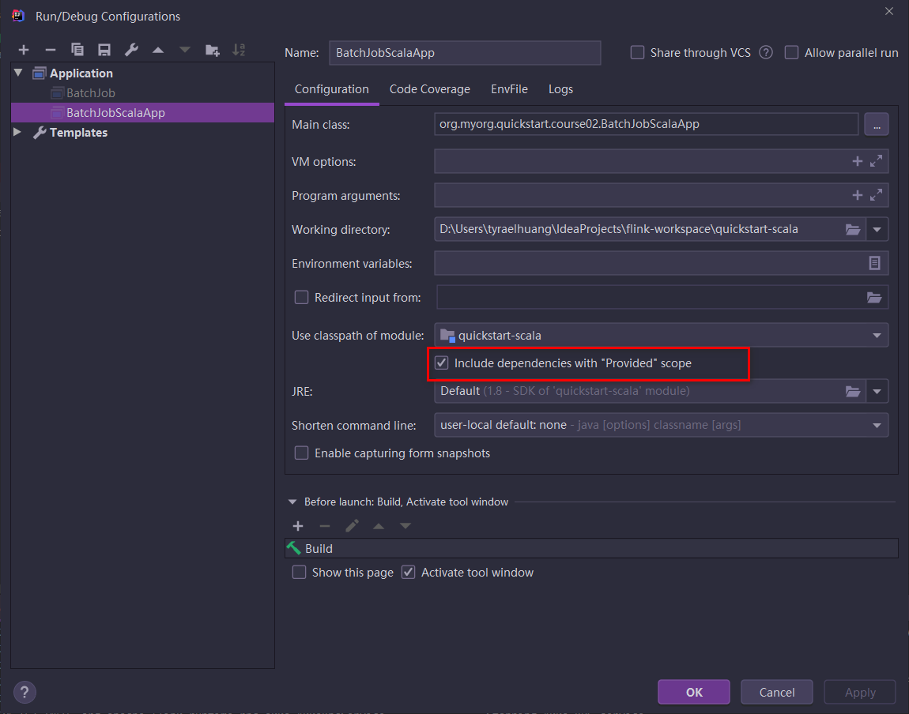

## 启动报错ClassNotFoundException：org.apache.flink.api.scala.typeutils.CaseClassTypeInfo

```
Caused by: java.lang.ClassNotFoundException: org.apache.flink.api.scala.typeutils.CaseClassTypeInfo
	at java.net.URLClassLoader.findClass(URLClassLoader.java:381)
	at java.lang.ClassLoader.loadClass(ClassLoader.java:424)
	at sun.misc.Launcher$AppClassLoader.loadClass(Launcher.java:349)
	at java.lang.ClassLoader.loadClass(ClassLoader.java:357)
	... 1 more
```

### 原因排查 [原因解析](./scope=compile和provided区别.md)

以为是导包的问题：

```
import org.apache.flink.api.scala.ExecutionEnvironment
```

结果发现不是

发现是maven引入依赖的问题


两种解决办法：

1. 解决方案是去掉scope，问题解决！

2. 在 *Run/Debug Configurations* 中勾选 *Include dependencies with “Provided” scope*，保存之后再运行就好了。

   

## 启动报错org.apache.flink.api.common.InvalidProgramException: This type (GenericType<org.myorg.quickstart.course03.StreamingWCJavaApp03.WordCcount>) cannot be used as key.

```
16:57:22,390 INFO  org.apache.flink.api.java.typeutils.TypeExtractor             - class org.myorg.quickstart.course03.StreamingWCJavaApp03$WordCcount is missing a default constructor so it cannot be used as a POJO type and must be processed as GenericType. Please read the Flink documentation on "Data Types & Serialization" for details of the effect on performance.
Exception in thread "main" org.apache.flink.api.common.InvalidProgramException: This type (GenericType<org.myorg.quickstart.course03.StreamingWCJavaApp03.WordCcount>) cannot be used as key.
	at org.apache.flink.api.common.operators.Keys$ExpressionKeys.<init>(Keys.java:330)
	at org.apache.flink.streaming.api.datastream.DataStream.keyBy(DataStream.java:340)
	at org.myorg.quickstart.course03.StreamingWCJavaApp03.main(StreamingWCJavaApp03.java:48)
```

### 原因排查

class org.myorg.quickstart.course03.StreamingWCJavaApp03$WordCcount is **missing a default constructor** so it **cannot be used as a POJO type** and must be processed as GenericType. Please read the Flink documentation on "Data Types & Serialization" for details of the effect on performance.

需要加上无参的构造器

[POJO 与其他对象的区别]()

## java.lang.InternalError: Malformed class name问题

在Flink中定义

```scala
  def fromCsvFile(env: ExecutionEnvironment): Unit = {
    val filePath = "file:///D:\\Users\\tyraelhuang\\IdeaProjects\\flink-workspace\\test-data\\people.csv"
    //    env.readCsvFile[(String, Int, String)](filePath, ignoreFirstLine = true).print()

    //    env.readCsvFile[(String,Int)](filePath,ignoreFirstLine = true,includedFields = Array(0,1)).print()
    case class MyCaseClass(name: String, age: Int)
    env.readCsvFile[MyCaseClass](filePath, ignoreFirstLine = true, includedFields = Array(0, 1)).print()
  }
}
```

报错 Malformed class name，在异常栈中找到发现了lookupConstructor的报错，猜测是内部类的问题，所以把内部类放在fromCsvFile之外，异常解决。

### IDEA连接数据库错误

```
jdbc:mysql://localhost:3306/saam_tx_permission?useUnicode=true&characterEncoding=UTF-8&useJDBCCompliantTimezoneShift=true&useLegacyDatetimeCode=false&serverTimezone=Asia/Shanghai
```

