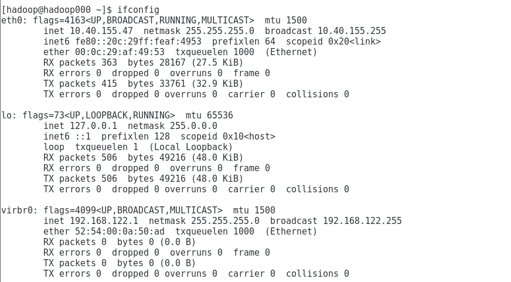
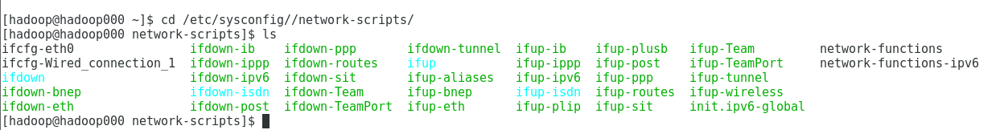
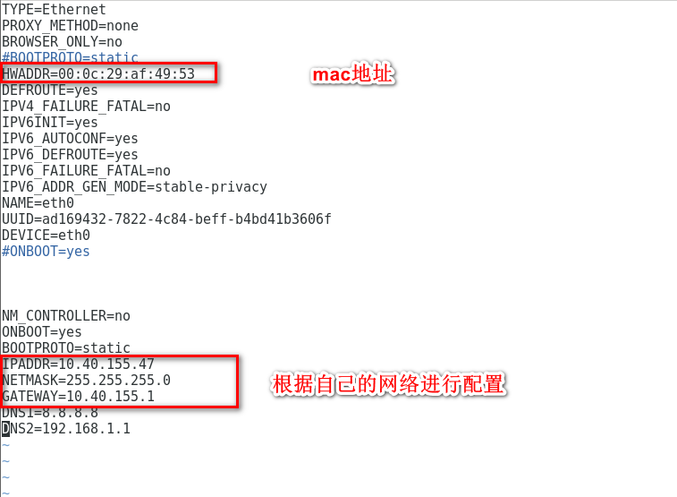
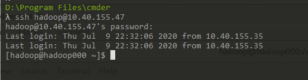

# OOTB环境使用

- `ifconfig`查看网络环境

  

- `cd /etc/sysconfig/network-scripts/`进入配置文件目录

  

- 输入`ip addr`找到对应的mac地址，将mac地址复制在`ifcfg-eth0`文件中

- 修改配置文件 `ifcfg-eth0` 使用代码`vim ifcfg-eth0`

  

- 使用 `vim /etc/hosts`，修改相应的`hostname`和`ip`的值。

- reboot进行重启就可以访问了

- 使用`ssh hadoop@10.40.155.47`就可以在本地进行访问了

  

- 在终端ssh的断开方法
  - 法1：Ctrl+D
  - 法2：输入 logout

- 传输文件的方法

  1、从服务器上下载文件
  `scp username@servername:/path/filename /var/www/local_dir（本地目录）`

   例如`scp root@192.168.0.101:/var/www/test.txt` 把192.168.0.101上的/var/www/test.txt 的文件下载到/var/www/local_dir（本地目录）

  

  2、上传本地文件到服务器
  `scp /path/filename username@servername:/path  `

  例如`scp /var/www/test.php root@192.168.0.101:/var/www/ `把本机`/var/www/`目录下的`test.php`文件上传到192.168.0.101这台服务器上的`/var/www/`目录中

   

  3、从服务器下载整个目录
  `scp -r username@servername:/var/www/remote_dir/`（远程目录） `/var/www/local_dir`（本地目录）

  例如:`scp -r root@192.168.0.101:/var/www/test /var/www/  `

  4、上传目录到服务器
  `scp -r local_dir username@servername:remote_dir`
  例如：`scp -r test  root@192.168.0.101:/var/www/`  把当前目录下的test目录上传到服务器的/var/www/ 目录

   

  注：目标服务器要开启写入权限。