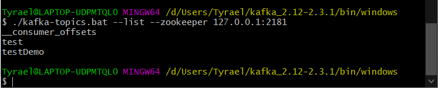

# Zookeeper，Kafka部署步骤

## ZooKeeper（centos）

https://archive.cloudera.com/cdh5/cdh/5/

ssh hadoop@192.168.199.233

- 从~/software下解压到~/app目录下
  
   - `tar -zxvf zookeeper-3.4.5-cdh5.15.1.tar.gz -C  ~/app`
   
- 配置系统环境变量  ~/.bash_profile

- 
  	
  	
  
  - 使用 `source ~/.bash_profile`刷新环境变量
  
- 使用 `echo $ZK_HOME`判断环境变量是否生效

- 配置文件  $ZK_HOME/conf/zoo.cfg  dataDir不要放在默认的/tmp下
   - `cp zoo_sample.cfg zoo.cfg`
   - `vim zoo.cfg`
   - dataDir不要放在默认的/tmp下，系统tmp会在系统重启的时候全部删除
   - 
   
- 启动ZK   

   - ```
      $ZK_HOME/bin/zkServer.sh start
      ```

- 检查是否启动成功   `jps ` 如果有这个QuorumPeerMain进程，则启动成功

## Kafka（centos）

wget http://mirrors.tuna.tsinghua.edu.cn/apache/kafka/1.1.1/kafka_2.11-1.1.1.tgz
	
ssh hadoop@192.168.199.233

- 从~/software下解压到~/app目录下

- 配置系统环境变量  ~/.bash_profile

- 配置文件 $KAFKA_HOME/config/server.properties
	
	- log.dirs 不要放在默认的/tmp下
	- 
	- 
	
- 启动Kafka 

  - ```
    $KAFKA_HOME/bin/kafka-server-start.sh -daemon /home/hadoop/app/kafka_2.11-1.1.1/config/server.properties
    ```

- 检查是否启动成功 `jps Kafka`

- 创建topic

  ```
  ./kafka-topics.sh --create --zookeeper 127.0.0.1:2181 --replication-factor 1 --partitions 1 --topic tyraeltest
  ```

- 查看所有的topic

  ```
  ./kafka-topics.sh --list --zookeeper 127.0.0.1:2181
  ```

- 启动生产者

  ```
  ./kafka-console-producer.sh --broker-list 127.0.0.1:9092 --topic tyraeltest
  ```

- 启动消费者

  ```
  ./kafka-console-consumer.sh --bootstrap-server 127.0.0.1:9092 --topic tyraeltest
  ```

  

# windows下搭建Kafka运行环境

### 一、安装JDK

1. JDK下载路径  http://www.oracle.com/technetwork/java/javase/downloads/jdk8-downloads-2133151.html

2. 按照网上参考步骤，依次配置JAVA_HOME、Classpath和Path，然后打开cmd，运行java -version成功，则JDK配置成功；

### 二、安装Zookeeper

由于Kafka的运行依赖于Zookeeper，所以在运行Kafka之前需要安装并运行Zookeeper

1. Zookeeper下载路径  http://zookeeper.apache.org/releases.html#download

2. 解压到文件下（我的目录是  D:\Program Files\zookeeper-3.5.2-alpha）

3. 打开D:\Program Files\zookeeper-3.5.2-alpha\conf，复制zoo_sample.cfg重命名成zoo.cfg

4. 编辑zoo.cfg，修改dataDir为【dataDir=/zookeeper-3.5.2-alpha/data】

5. 添加环境变量

  ZK_HOME      D:\Users\Tyrael\zookeeper-3.4.14
  Path 在现有的值后面添加   ;%ZK_HOME%\bin;

6. 打开cmd，运行Zookeeper---zkserver


### 三、安装Kafka

1.Kafka下载路径  http://kafka.apache.org/downloads

2.解压文件（我的目录是D:\Users\Tyrael\kafka_2.12-2.3.1  【这里不要在Program Files等文件名之间有空格的目录下，不然一会执行会不识别路径】）

3.打开目录D:\Users\Tyrael\kafka_2.12-2.3.1\config下server.properties文件，把log.dirs修改为【log.dirs=D:\Users\Tyrael\kafka_2.12-2.3.1\kafka-logs】

4.进入kafka文件目录D:\Users\Tyrael\kafka_2.12-2.3.1\bin\windows，执行以下命令，启动kafka通讯的服务器broker

```css
 ./kafka-server-start.bat ../../config/server.properties
```


5.进入kafka文件目录D:\kafka_2.12-0.11.0.0\bin\windows，创建kafka的消息topics

```css
kafka-topics.bat --create --zookeeper localhost:2181 --replication-factor 1 --partitions 1 --topic testDemo
```



6.分别打开两个cmd窗口，进入目录D:\kafka_2.12-0.11.0.0\bin\windows，创建Producer和Consumer

（1）Producer

进入目录D:\kafka_2.12-0.11.0.0\bin\windows输入如下命令

```css
 ./kafka-console-producer.bat --broker-list localhost:9092 --topic testDemo
```

 

（2）Consumer

进入目录D:\kafka_2.12-0.11.0.0\bin\windows输入如下命令

```css
./windows/kafka-console-consumer.bat --bootstrap-server 127.0.0.1:9092 --topic testDemo --from-beginning
```


然后就可以在Producer中发信息，在Consumer中收信息了 


 