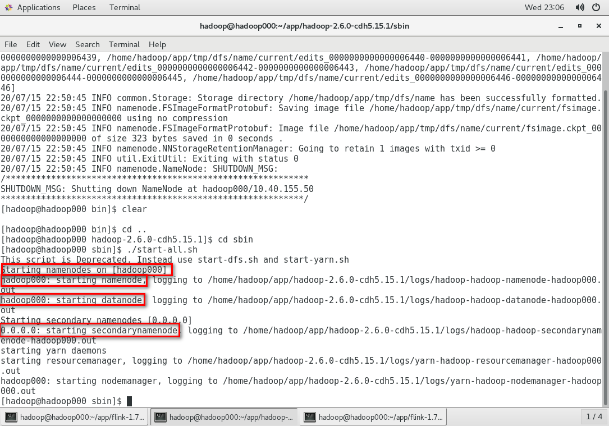

# Hadoop集群搭建

1. 通过https://archive.cloudera.com/cdh5/cdh/5/，下载hadoop-2.6.0-cdn5.15.1.tar.gz安装包

2. tar -zxvf 解压
3. 需要JDK，SSH
4. 修改环境变量 添加$HADOOP_HOME
5. 修改hadoop-env.sh，修改JAVA_HOME的参数
6. 修改core-site.xml
7. 修改hdfs-site.xml
8. 修改slaves
9. 配置yarn-site.xml和mapred-site.xml
10. 格式化hfds，cd bin，./hdfs namenode -format
11. 启动hdfs，cd sbin， ./start-all.sh

